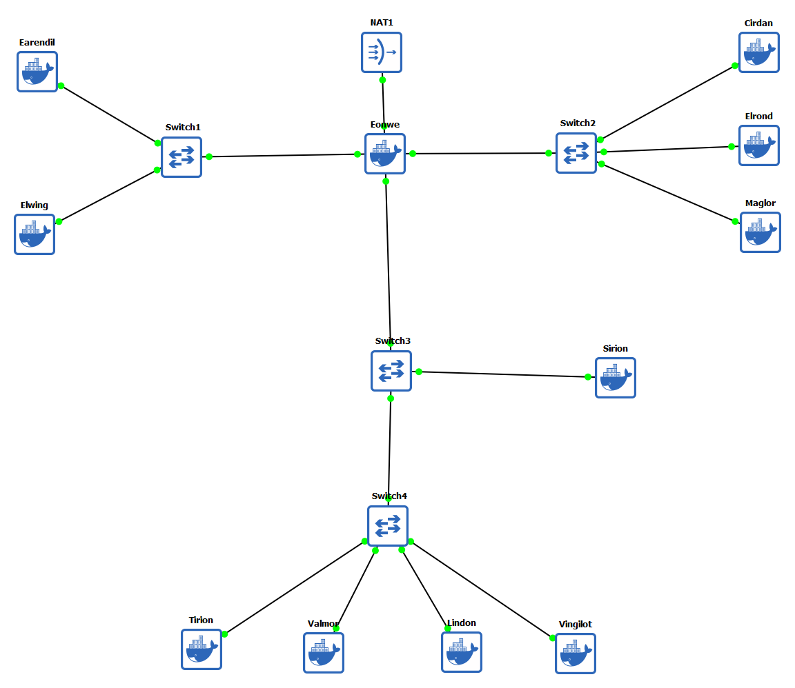

# Jarkom-Modul-01-2025-K44

Nama                  | NRP
----------------------|-----------
Ahmad Yazid Arifuddin | 5027241040
Tiara Fatimah Azzahra |	5027241090

## Soal 1
Pertama tama buat topologi di GNS3 terlebih dahulu

setelah itu config di setiap node nya

#### Router
```
auto eth0
iface eth0 inet dhcp

auto eth1
iface eth1 inet static
    	address 192.233.1.1
    	netmask 255.255.255.0

auto eth2
iface eth2 inet static
    	address 192.233.2.1
    	netmask 255.255.255.0

auto eth3
iface eth3 inet static
    	address 192.233.3.1
    	netmask 255.255.255.0
```

#### Barat
- Earendil
```
auto eth0
iface eth0 inet static
    	address 192.233.1.2
        netmask 255.255.255.0	
    	gateway 192.233.1.1
up echo nameserver 192.168.122.1 > /etc/resolv.conf
```

- Elwing
```
auto eth0
iface eth0 inet static
    	address 192.233.1.3
        netmask 255.255.255.0
    	gateway 192.233.1.1
up echo nameserver 192.168.122.1 > /etc/resolv.conf	
```

#### Timur
- Cirdan
```
auto eth0
iface eth0 inet static
        address 192.233.2.2
    	netmask 255.255.255.0
    	gateway 192.233.2.1
up echo nameserver 192.168.122.1 > /etc/resolv.conf
```
- Elrond
```
auto eth0
iface eth0 inet static
    	address 192.233.2.3
    	netmask 255.255.255.0
    	gateway 192.233.2.1
up echo nameserver 192.168.122.1 > /etc/resolv.conf
```
- Maglor
```
auto eth0
iface eth0 inet static
    	address 192.233.2.4
    	netmask 255.255.255.0
    	gateway 192.233.2.1
up echo nameserver 192.168.122.1 > /etc/resolv.conf
```

#### Pelabuhan DMZ (Switch 3)
- Sirion
```
auto eth0
iface eth0 inet static
    	address 192.233.3.2
    	netmask 255.255.255.0
    	gateway 192.233.3.1
up echo nameserver 192.168.122.1 > /etc/resolv.conf
```

#### Pelabuhan DMZ (Switch 4)
- Tirion
```
auto eth0
iface eth0 inet static
    	address 192.233.3.3
    	netmask 255.255.255.0
        gateway 192.233.3.1
up echo nameserver 192.168.122.1 > /etc/resolv.conf
```
- Valmar
```
auto eth0
iface eth0 inet static
    	address 192.233.3.4
    	netmask 255.255.255.0
        gateway 192.233.3.1
up echo nameserver 192.168.122.1 > /etc/resolv.conf
```
- Lindon
```
auto eth0
iface eth0 inet static
        address 192.233.3.5
    	netmask 255.255.255.0
    	gateway 192.233.3.1
up echo nameserver 192.168.122.1 > /etc/resolv.conf
```
- Vingilot
```
auto eth0
iface eth0 inet static
    	address 192.233.3.6
        netmask 255.255.255.0
    	gateway 192.233.3.1
up echo nameserver 192.168.122.1 > /etc/resolv.conf
```


## Soal 2

Node Eonwe
```
echo 1 > /proc/sys/net/ipv4/ip_forward
apt update
apt install -y iptables

iptables -t nat -A POSTROUTING -o eth0 -j MASQUERADE -s 192.233.0.0/16

# Test di semua Node
apt update
apt install -y iptables
ping -c 5 google.com # Tes Internet
```
## Soal 3

## Soal 4

## Soal 5

## Soal 6

## Soal 7

## Soal 8

## Soal 9

## Soal 10 

## Soal 11

## Soal 12

## Soal 13

## Soal 14

## Soal 15

## Soal 16

## Soal 17

## Soal 18

## Soal 19

## Soal 20

