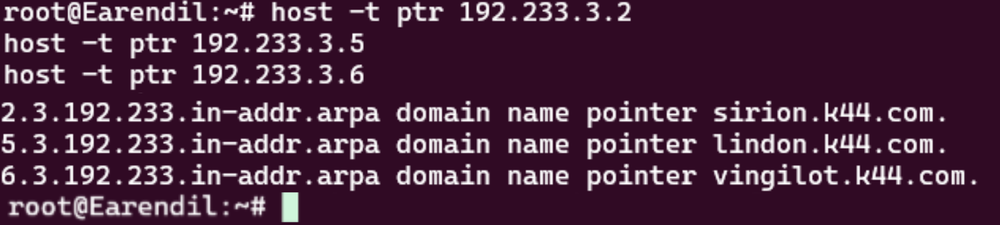
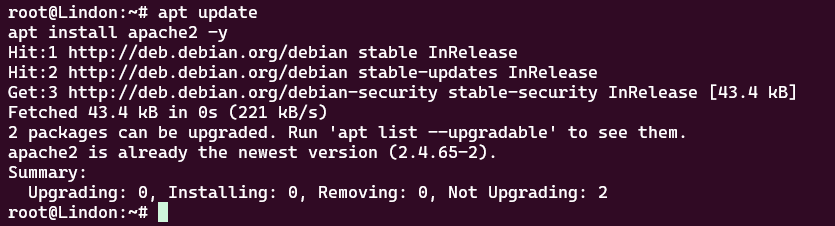
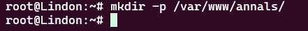
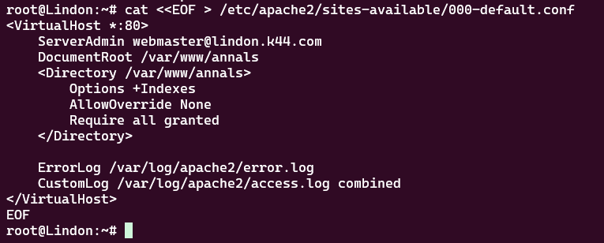
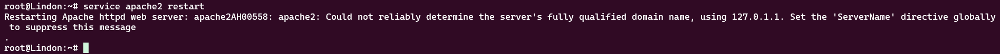
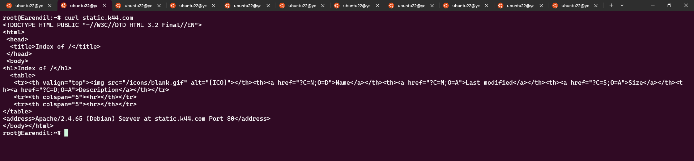
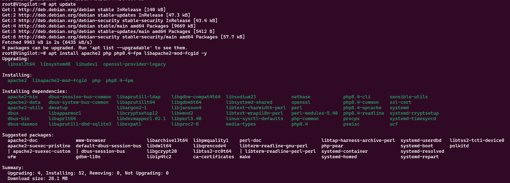
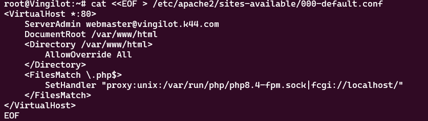
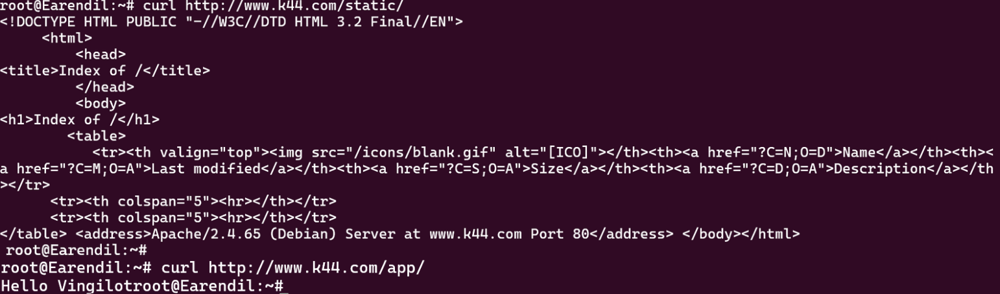

# Jarkom-Modul-01-2025-K44

Nama                  | NRP
----------------------|-----------
Ahmad Yazid Arifuddin | 5027241040
Tiara Fatimah Azzahra |	5027241090

## Laporan

---

1. Di tepi Beleriand yang porak-poranda, Eonwe merentangkan tiga jalur strategis untuk memfasilitasi komunikasi dan distribusi sumber daya di seluruh wilayah yang telah hancur akibat perang. Jalur Barat diperuntukkan bagi Earendil dan Elwing sebagai penghuni utama wilayah tersebut, sementara jalur Timur melayani Círdan, Elrond, dan Maglor yang merupakan pemimpin-pemimpin penting di wilayah timur. Selain itu, dibangun pula pelabuhan DMZ (Demilitarized Zone) yang menjadi pusat administrasi dan keamanan bagi Sirion, Tirion, Valmar, Lindon, dan Vingilot. Setiap tokoh dalam jaringan ini harus memiliki alamat IP yang unik dan default gateway yang tepat agar dapat berkomunikasi secara efektif melalui router Eonwe yang berfungsi sebagai pusat konektivitas utama.

---

**Penjelasan:** Pada tahap ini, kami membangun topologi jaringan yang terdiri dari tiga segmen utama. Router Eonwe berfungsi sebagai gateway utama dengan tiga interface yang menghubungkan segmen Barat (192.233.1.0/24), Timur (192.233.2.0/24), dan DMZ (192.233.3.0/24). Setiap host dikonfigurasi dengan alamat IP statis sesuai dengan segmennya dan gateway yang mengarah ke Eonwe. Konfigurasi ini memungkinkan komunikasi antar segmen melalui router Eonwe sebagai penghubung utama.


**Eonwe**

```
auto eth0
iface eth0 inet dhcp

auto eth1
iface eth1 inet static
  address 192.233.1.1
  netmask 255.255.255.0

auto eth2
iface eth2 inet static
  address 192.233.2.1
  netmask 255.255.255.0

auto eth3
iface eth3 inet static
  address 192.233.3.1
  netmask 255.255.255.0
```

**Earendil**

```
auto eth0
iface eth0 inet static
  address 192.233.1.2
  netmask 255.255.255.0
  gateway 192.233.1.1
```

**Elwing**

```
auto eth0
iface eth0 inet static
  address 192.233.1.3
  netmask 255.255.255.0
  gateway 192.233.1.1
```

**Cirdan**

```
auto eth0
iface eth0 inet static
  address 192.233.2.2
  netmask 255.255.255.0
  gateway 192.233.2.1
```

**Elrond**

```
auto eth0
iface eth0 inet static
  address 192.233.2.3
  netmask 255.255.255.0
  gateway 192.233.2.1
```

**Maglor**

```
auto eth0
iface eth0 inet static
  address 192.233.2.4
  netmask 255.255.255.0
  gateway 192.233.2.1
```

**Sirion**

```
auto eth0
iface eth0 inet static
  address 192.233.3.2
  netmask 255.255.255.0
  gateway 192.233.3.1
```

**Tirion**

```
auto eth0
iface eth0 inet static
address 192.233.3.3
netmask 255.255.255.0
gateway 192.233.3.1
```

**Valmar**

```
auto eth0
iface eth0 inet static
  address 192.233.3.4
  netmask 255.255.255.0
  gateway 192.233.3.1
```

**Lindon**

```
auto eth0
iface eth0 inet static
  address 192.233.3.5
  netmask 255.255.255.0
  gateway 192.233.3.1
```

**Vingilot**

```
auto eth0
iface eth0 inet static
  address 192.233.3.6
  netmask 255.255.255.0
  gateway 192.233.3.1
```

---

2. Angin dari luar mulai berhembus ketika Eonwe membuka jalan ke awan NAT, menandai dimulainya era konektivitas global bagi seluruh penghuni Beleriand. Implementasi Network Address Translation (NAT) ini memungkinkan semua host internal yang berada di belakang router Eonwe untuk mengakses layanan internet eksternal menggunakan alamat IP publik yang dibagikan. Proses ini sangat penting untuk memastikan bahwa setiap host di dalam jaringan privat dapat berkomunikasi dengan dunia luar tanpa memerlukan alamat IP publik yang terpisah untuk setiap perangkat, sehingga menghemat sumber daya alamat IP yang terbatas dan meningkatkan keamanan jaringan internal.
---

**Penjelasan:** Konfigurasi NAT pada router Eonwe memungkinkan semua host dalam jaringan privat (192.233.0.0/16) untuk mengakses internet melalui interface eth0 yang terhubung ke jaringan eksternal. Dengan menggunakan iptables MASQUERADE, semua traffic dari jaringan internal akan tampak berasal dari IP publik Eonwe saat berkomunikasi dengan internet, sehingga menghemat penggunaan alamat IP publik dan meningkatkan keamanan dengan menyembunyikan struktur jaringan internal.


Isi konfigurasi pada router Eonwe /root/.bashrc
```sh
apt update
apt install iptables -y
iptables -t nat -A POSTROUTING -o eth0 -j MASQUERADE -s 192.233.0.0/16
```


---

3. Kabar dari Barat menyapa Timur, menandai dimulainya era komunikasi lintas wilayah yang harmonis di seluruh Beleriand. Implementasi routing internal yang efektif melalui router Eonwe memungkinkan kelima klien dari berbagai segmen jaringan untuk saling berkomunikasi tanpa hambatan, menciptakan jaringan yang terintegrasi dan efisien. Selain itu, setiap host non-router harus dikonfigurasi dengan resolver DNS eksternal (192.168.122.1) yang akan memungkinkan mereka untuk melakukan resolusi nama domain internet sejak awal aktivasi interface, sehingga memastikan akses penuh ke layanan eksternal dan memfasilitasi komunikasi yang lancar dengan dunia luar.
---
**Penjelasan:** Router Eonwe telah dikonfigurasi untuk melakukan routing antar segmen jaringan, memungkinkan host dari segmen Barat (192.233.1.0/24) berkomunikasi dengan host dari segmen Timur (192.233.2.0/24) dan DMZ (192.233.3.0/24). Selain itu, semua host non-router dikonfigurasi dengan DNS resolver eksternal (192.168.122.1) untuk memungkinkan resolusi nama domain internet, memastikan akses penuh ke layanan eksternal.


Masukkan resolver 192.168.122.1 ke semua non-router
```sh
echo "nameserver 192.168.122.1" > /etc/resolv.conf
```


Lalu untuk mengecek klien barat menyapa timur dengan ngeping ip 192.233.2.2 pada terminal router timur misal Earendil
```sh
ping 192.233.2.2
```


---

4. Para penjaga nama naik ke menara, menandai dimulainya era manajemen DNS yang terpusat dan terstruktur di seluruh Beleriand. Di Tirion (ns1/master), dibangun zona \<xxxx>.com sebagai server DNS authoritative yang akan menjadi pusat resolusi nama domain untuk seluruh wilayah. Konfigurasi ini meliputi pembuatan Start of Authority (SOA) record yang menunjuk ke ns1.\<xxxx>.com sebagai server utama, serta Name Server (NS) records untuk ns1.\<xxxx>.com dan ns2.\<xxxx>.com yang akan melayani zona tersebut. Selain itu, dibuat A records untuk ns1.\<xxxx>.com dan ns2.\<xxxx>.com yang mengarah ke alamat Tirion dan Valmar, serta A record apex \<xxxx>.com yang mengarah ke alamat Sirion sebagai front door utama. Fitur notify dan allow-transfer diaktifkan untuk Valmar, dengan forwarders diset ke 192.168.122.1 untuk resolusi eksternal. Di Valmar (ns2/slave), zona \<xxxx>.com ditarik dari Tirion dan dikonfigurasi untuk menjawab secara authoritative. Pada seluruh host non-router, urutan resolver diubah menjadi ns1.\<xxxx>.com → ns2.\<xxxx>.com → 192.168.122.1 untuk memastikan resolusi yang optimal dan redundansi yang baik.
---
**Penjelasan:** Kami membangun infrastruktur DNS master-slave dengan Tirion sebagai server master dan Valmar sebagai server slave untuk zona k44.com. Konfigurasi meliputi SOA record, NS records, dan A records yang diperlukan. Server master dikonfigurasi dengan notify dan allow-transfer untuk Valmar, sementara server slave dikonfigurasi untuk menarik zona dari master. Semua host non-router dikonfigurasi untuk menggunakan DNS server internal sebagai prioritas utama, dengan fallback ke DNS eksternal.


**Tirion**

```sh
apt update
apt install bind9 -y
ln -s /etc/init.d/named /etc/init.d/bind9
```


```sh
cat <<EOF > /etc/bind/named.conf.options
options {
  directory "/var/cache/bind";

  forwarders {
    192.168.122.1;
  };

  allow-query { any; };
  auth-nxdomain no;
  listen-on { any; };
  listen-on-v6 { any; };
};

EOF
```


```sh
mkdir -p /etc/bind/k44 && cat <<EOF > /etc/bind/k44/k44.com
\$TTL    604800          ; Waktu cache default (detik)
@       IN      SOA     ns1.k44.com. root.k44.com. (
                        2025100401 ; Serial (format YYYYMMDDXX)
                        604800     ; Refresh (1 minggu)
                        86400      ; Retry (1 hari)
                        2419200    ; Expire (4 minggu)
                        604800 )   ; Negative Cache TTL

@        IN      NS     ns1.k44.com.
@        IN      NS     ns2.k44.com.

ns1     IN       A      192.233.3.3
ns2     IN       A      192.233.3.4

@       IN       A      192.233.3.2

EOF
```


```sh
cat <<EOF > /etc/bind/named.conf.local
zone "k44.com" {
  type master;
  file "/etc/bind/k44/k44.com";
  allow-transfer { 192.233.3.4; };
  notify yes;
};

EOF
```


```sh
service bind9 restart
```


```sh
echo "nameserver 192.233.3.3" > /etc/resolv.conf
echo "nameserver 192.233.3.4" >> /etc/resolv.conf
echo "nameserver 192.168.122.1" >> /etc/resolv.conf
```

```
dig @localhost k44.com
```


**Valmar**

```sh
apt update
apt install bind9 -y
ln -s /etc/init.d/named /etc/init.d/bind9
```

```
cat <<EOF > /etc/bind/named.conf.options
options {
  directory "/var/cache/bind";

  forwarders {
    192.168.122.1;
  };

  allow-query { any; };
  auth-nxdomain no;
  listen-on { any; };
  listen-on-v6 { any; };
};

EOF
```

```sh
mkdir -p /var/lib/bind/k44 && chown bind:bind /var/lib/bind/k44 && cat <<EOF > /etc/bind/named.conf.local
zone "k44.com" {
  type slave;
  masters { 192.233.3.3; };
  file "/var/lib/bind/k44/k44.com";
};

EOF
```


```sh
service bind9 restart
```


**All node**

```sh
echo "nameserver 192.233.3.3" > /etc/resolv.conf
echo "nameserver 192.233.3.4" >> /etc/resolv.conf
echo "nameserver 192.168.122.1" >> /etc/resolv.conf
```


---

5. "Nama memberi arah," kata Eonwe, menandai dimulainya era identitas yang jelas dan terstruktur di seluruh Beleriand. Setiap tokoh dalam jaringan ini harus memiliki hostname yang unik dan bermakna sesuai dengan glosarium yang telah ditetapkan: eonwe, earendil, elwing, cirdan, elrond, maglor, sirion, tirion, valmar, lindon, dan vingilot. Implementasi hostname ini memungkinkan setiap host untuk dikenali dan diakses dengan mudah melalui nama yang bermakna, bukan hanya alamat IP numerik yang sulit diingat. Selain itu, setiap node harus memiliki domain yang sesuai dengan namanya (contoh: eru.\<xxxx>.com) dan alamat IP yang telah ditetapkan sebelumnya. Pengecualian khusus dilakukan untuk node yang bertanggung jawab atas ns1 dan ns2, mengingat peran penting mereka dalam infrastruktur DNS yang telah dibangun.

---
**Penjelasan:** Kami menambahkan A records untuk semua host dalam jaringan ke zona DNS k44.com. Setiap host memiliki record A yang memetakan hostname ke alamat IP-nya masing-masing. Ini memungkinkan resolusi nama domain yang mudah diingat untuk setiap host dalam jaringan, menggantikan penggunaan alamat IP numerik yang sulit diingat.


```sh
cat <<EOF >> /etc/bind/k44/k44.com
earendil       IN       A      192.233.1.2
elwing         IN       A      192.233.1.3
cirdan         IN       A      192.233.2.2
elrond         IN       A      192.233.2.3
maglor         IN       A      192.233.2.4
sirion         IN       A      192.233.3.2
lindon         IN       A      192.233.3.5
vingilot       IN       A      192.233.3.6

EOF
```


```sh
service bind9 restart
```


---

6. Lonceng Valmar berdentang mengikuti irama Tirion, menandai dimulainya era sinkronisasi DNS yang harmonis dan terpercaya di seluruh Beleriand. Proses zone transfer yang efektif memastikan bahwa Valmar (ns2) sebagai server slave dapat menerima salinan zona terbaru dari Tirion (ns1) sebagai server master secara otomatis dan real-time. Sinkronisasi ini sangat penting untuk memastikan konsistensi data DNS di seluruh jaringan, sehingga setiap perubahan yang dilakukan di server master akan segera direfleksikan di server slave. Nilai serial SOA di kedua server harus selalu sama, menandakan bahwa transfer telah berhasil dan tidak ada data yang tertinggal atau tidak sinkron.

---
**Penjelasan:** Kami memverifikasi bahwa zone transfer antara server master (Tirion) dan server slave (Valmar) berfungsi dengan baik. Dengan menggunakan perintah dig untuk memeriksa SOA record dari kedua server, kami memastikan bahwa nilai serial SOA sama, yang menandakan bahwa sinkronisasi DNS berhasil dilakukan dan data di kedua server konsisten.


**Tirion**

```sh
dig @192.233.3.3 k44.com SOA +short
```


**Valmar**

```sh
dig @192.233.3.4 k44.com SOA +short
```


---

7. Peta kota dan pelabuhan dilukis dengan cermat, menandai dimulainya era infrastruktur web yang terintegrasi dan fungsional di seluruh Beleriand. Sirion berperan sebagai gerbang utama (front door) yang akan menerima semua permintaan masuk, sementara Lindon dikonfigurasi sebagai server web statis yang akan melayani konten statis seperti file HTML, CSS, dan gambar. Vingilot, di sisi lain, berfungsi sebagai server web dinamis yang dapat mengeksekusi skrip PHP dan aplikasi web yang kompleks. Pada zona <xxxx>.com, ditambahkan A records untuk sirion.<xxxx>.com (IP Sirion), lindon.<xxxx>.com (IP Lindon), dan vingilot.<xxxx>.com (IP Vingilot) untuk memastikan resolusi yang tepat. Selain itu, ditetapkan CNAME records yang strategis: www.<xxxx>.com → sirion.<xxxx>.com untuk akses utama, static.<xxxx>.com → lindon.<xxxx>.com untuk konten statis, dan app.<xxxx>.com → vingilot.<xxxx>.com untuk aplikasi dinamis. Verifikasi dilakukan dari dua klien berbeda untuk memastikan bahwa seluruh hostname tersebut ter-resolve ke tujuan yang benar dan konsisten di seluruh jaringan.

---
**Penjelasan:** Kami menambahkan CNAME records untuk membangun infrastruktur web yang terintegrasi. Record www.k44.com mengarah ke sirion.k44.com sebagai front door utama, static.k44.com mengarah ke lindon.k44.com untuk konten statis, dan app.k44.com mengarah ke vingilot.k44.com untuk aplikasi dinamis. Konfigurasi ini memungkinkan akses yang mudah dan terorganisir ke berbagai layanan web melalui hostname yang bermakna.


```sh
cat <<EOF >> /etc/bind/k44/k44.com
www       IN       CNAME      sirion.k44.com.
static    IN       CNAME      lindon.k44.com.
app       IN       CNAME      elrond.k44.com.

EOF
```


```sh
service bind9 restart
```


---

8. Setiap jejak harus bisa diikuti, menandai dimulainya era reverse DNS yang komprehensif dan terstruktur di seluruh Beleriand. Di Tirion (ns1), dideklarasikan satu reverse zone khusus untuk segmen DMZ tempat Sirion, Lindon, dan Vingilot berada, memungkinkan pencarian balik dari alamat IP ke hostname yang sesuai. Di Valmar (ns2), reverse zone tersebut ditarik sebagai slave untuk memastikan redundansi dan ketersediaan yang tinggi. PTR records diisi untuk ketiga hostname tersebut agar pencarian balik IP address dapat mengembalikan hostname yang benar dan akurat. Implementasi ini memastikan bahwa query reverse untuk alamat Sirion, Lindon, dan Vingilot dijawab secara authoritative, memberikan kemampuan pelacakan dan identifikasi yang lengkap untuk setiap perangkat dalam jaringan.

---
**Penjelasan:** Kami mengkonfigurasi reverse DNS zone untuk segmen DMZ (192.233.3.0/24) dengan membuat zone 3.233.192.in-addr.arpa di Tirion sebagai master dan Valmar sebagai slave. PTR records dikonfigurasi untuk memetakan alamat IP ke hostname yang sesuai, memungkinkan pencarian balik dari IP address ke hostname. Ini memastikan bahwa setiap host dalam segmen DMZ dapat diidentifikasi melalui IP address-nya.


#### **Konfigurasi di Tirion (Master)**

Pertama, kami mendeklarasikan *reverse zone* `3.233.192.in-addr.arpa` di file `/etc/bind/named.conf.local`.

```sh
cat <<EOF >> /etc/bind/named.conf.local
zone "3.233.192.in-addr.arpa" {
    type master;
    file "/etc/bind/k44/3.233.192.in-addr.arpa";
    allow-transfer { 192.233.3.4; };
};
EOF
```


Selanjutnya, kami membuat file *zone*-nya dan mengisinya dengan *record* `PTR` untuk Sirion (`192.233.3.2`), Lindon (`192.233.3.5`), dan Vingilot (`192.233.3.6`).

```sh
cat <<EOF > /etc/bind/k44/3.233.192.in-addr.arpa
\$TTL    604800
@       IN      SOA     ns1.k44.com. root.k44.com. (
                        2025100401 ; Serial
                        604800     ; Refresh
                        86400      ; Retry
                        2419200    ; Expire
                        604800 )   ; Negative Cache TTL

@        IN      NS     ns1.k44.com.
@        IN      NS     ns2.k44.com.

2       IN       PTR    sirion.k44.com.
5       IN       PTR    lindon.k44.com.
6       IN       PTR    vingilot.k44.com.
EOF
```


#### **Konfigurasi di Valmar (Slave)**

Di Valmar, kami mengkonfigurasinya sebagai *slave* untuk *reverse zone* yang sama, dengan menunjuk Tirion sebagai *master*.

```sh
cat <<EOF >> /etc/bind/named.conf.local
zone "3.233.192.in-addr.arpa" {
  type slave;
  masters { 192.233.3.3; };
  file "/var/lib/bind/k44/3.233.192.in-addr.arpa";
};
EOF
```

#### **Verifikasi**

Pengujian dilakukan dari klien **Earendil** menggunakan perintah:

```sh
host -t ptr 192.233.3.2
host -t ptr 192.233.3.5
host -t ptr 192.233.3.6
```

Hasil verifikasi menunjukkan bahwa setiap alamat IP berhasil dipetakan kembali ke *hostname* yang sesuai, menandakan konfigurasi *Reverse DNS* telah berhasil.


---

9. Lampion Lindon dinyalakan, menandai dimulainya era layanan web statis yang terstruktur dan mudah diakses di seluruh Beleriand. Implementasi web server statis pada hostname static.\<xxxx>.com memungkinkan pengguna untuk mengakses konten web dengan mudah melalui nama domain yang bermakna, bukan hanya alamat IP numerik yang sulit diingat. Folder arsip /annals/ dikonfigurasi dengan fitur autoindex (directory listing) yang memungkinkan pengguna untuk menelusuri isi direktori secara interaktif dan intuitif, seolah-olah mereka sedang menjelajahi sistem file lokal. Akses ke layanan ini harus dilakukan melalui hostname untuk memastikan konsistensi dan kemudahan penggunaan di seluruh jaringan.

---
**Penjelasan:** Kami mengkonfigurasi Lindon sebagai web server statis menggunakan Apache2. Server dikonfigurasi untuk menyajikan konten dari direktori /var/www/annals/ dengan fitur autoindex yang memungkinkan directory listing. Konfigurasi virtual host memastikan bahwa server dapat diakses melalui hostname static.k44.com dan menampilkan daftar file dalam direktori secara otomatis.


Pada soal ini, kami bertugas untuk mengaktifkan **Lindon** sebagai *web server* statis. Sesuai permintaan, *server* ini harus menyajikan konten dari direktori `/annals/` dengan fitur *autoindex* (daftar file) aktif. Akses ke *server* ini dilakukan melalui *hostname* `static.k44.com`.

#### **Konfigurasi di Lindon**

Langkah pertama adalah menginstal **Apache2**, yang merupakan perangkat lunak *web server* yang akan kami gunakan.

```sh
apt update
apt install apache2 -y
```

Selanjutnya, kami membuat direktori `/var/www/annals/` yang akan menjadi *root* atau direktori utama untuk konten web.

```sh
mkdir -p /var/www/annals/
```



Kemudian, kami membuat file konfigurasi *Virtual Host* baru untuk Apache. Konfigurasi ini mengarahkan semua permintaan ke `DocumentRoot` `/var/www/annals` dan yang terpenting, mengaktifkan `Options +Indexes` untuk mengizinkan *directory listing*.

```sh
cat <<EOF > /etc/apache2/sites-available/000-default.conf
<VirtualHost *:80>
    ServerAdmin webmaster@lindon.k44.com
    DocumentRoot /var/www/annals
    <Directory /var/www/annals>
        Options +Indexes
        AllowOverride None
        Require all granted
    </Directory>

    ErrorLog /var/log/apache2/error.log
    CustomLog /var/log/apache2/access.log combined
</VirtualHost>
EOF
```


Terakhir, kami me-restart layanan Apache2 untuk menerapkan semua perubahan konfigurasi.

```sh
service apache2 restart
```


--
#### **Validasi**

Untuk membuktikan bahwa *web server* di Lindon berjalan dengan benar, kami melakukan validasi dari salah satu klien, yaitu **Earendil**.

**Cara Validasi:**
Kami menggunakan perintah `curl` untuk mengakses *hostname* `static.k44.com` dari terminal Earendil. `curl` adalah alat baris perintah yang digunakan untuk mentransfer data dengan URL, yang dalam kasus ini akan mengambil konten halaman web.

```sh
curl static.k44.com
```


**Hasil yang Diharapkan:**
Jika konfigurasi berhasil, perintah `curl` akan mengembalikan output berupa kode HTML. Output ini adalah halaman yang secara otomatis dibuat oleh Apache karena fitur `autoindex` aktif. Halaman ini akan berisi judul **"Index of /"**, yang menandakan bahwa *web server* berhasil menyajikan daftar isi dari direktori `/var/www/annals/`.


---

10. Vingilot mengisahkan cerita dinamis, menandai dimulainya era aplikasi web yang interaktif dan responsif di seluruh Beleriand. Implementasi web dinamis menggunakan PHP-FPM pada hostname app.\<xxxx>.com memungkinkan pengembangan aplikasi web yang kompleks dan dinamis, dengan kemampuan untuk mengeksekusi skrip PHP secara efisien dan aman. Aplikasi ini dilengkapi dengan beranda yang menarik dan halaman about yang informatif, memberikan pengalaman pengguna yang lengkap dan profesional. Fitur URL rewrite diterapkan sehingga pengguna dapat mengakses /about tanpa perlu mengetik akhiran .php, menciptakan URL yang lebih bersih dan user-friendly. Akses ke layanan ini harus dilakukan melalui hostname untuk memastikan konsistensi dan kemudahan penggunaan di seluruh jaringan.

**Penjelasan:** Kami mengkonfigurasi Vingilot sebagai web server dinamis menggunakan Apache2 dengan PHP-FPM. Server dikonfigurasi untuk mengeksekusi skrip PHP melalui FastCGI interface. Fitur URL rewrite dikonfigurasi menggunakan .htaccess untuk memungkinkan akses ke halaman about tanpa ekstensi .php. Server dapat diakses melalui hostname app.k44.com dan mengeksekusi aplikasi PHP dengan performa yang optimal.

---


Pada tahap ini, kami mengkonfigurasi **Vingilot** untuk berfungsi sebagai *web server* dinamis yang dapat mengeksekusi skrip PHP. Implementasi ini menggunakan **PHP-FPM** (FastCGI Process Manager) untuk performa yang lebih baik dan menerapkan **URL Rewrite** agar URL lebih ramah pengguna.

--

#### **Konfigurasi di Vingilot**

Langkah pertama adalah menginstal paket-paket yang diperlukan, yaitu Apache2, PHP, dan modul-modul terkait.

```sh
apt install apache2 php php8.4-fpm libapache2-mod-fcgid -y
```


Selanjutnya, kami mengkonfigurasi *Virtual Host* Apache untuk meneruskan permintaan file `.php` ke *service* PHP-FPM melalui *socket*.

```sh
cat <<EOF > /etc/apache2/sites-available/000-default.conf
<VirtualHost *:80>
    ServerAdmin webmaster@vingilot.k44.com
    DocumentRoot /var/www/html
    <Directory /var/www/html>
        AllowOverride All
    </Directory>
    <FilesMatch \.php$>
        SetHandler "proxy:unix:/var/run/php/php8.4-fpm.sock|fcgi://localhost/"
    </FilesMatch>
</VirtualHost>
EOF
```


Untuk mengaktifkan URL *rewrite* (misalnya `/about` menjadi `about.php`), kami membuat file `.htaccess` di direktori web.

```sh
cat <<EOF > /var/www/html/.htaccess
RewriteEngine On
RewriteRule ^about$ about.php [L]
EOF
```

Kami juga membuat dua file PHP sederhana, `index.php` dan `about.php`, sebagai konten untuk validasi. Terakhir, kami mengaktifkan modul Apache yang diperlukan dan me-restart layanan PHP-FPM serta Apache2.

--

#### **Validasi**

Untuk membuktikan bahwa *web server* dinamis di Vingilot berfungsi dengan benar, kami melakukan validasi dari klien **Earendil** menggunakan `curl`.


1.  **Mengakses Halaman Utama:** Perintah ini untuk memverifikasi eksekusi PHP dasar.

    ```sh
    curl http://app.k44.com/
    ```
    **Hasil:** Server berhasil merespons dengan output dari `index.php`, yaitu `Hello Vingilot`.


2.  **Mengakses Halaman dengan URL Rewrite:** Perintah ini untuk memverifikasi bahwa aturan di `.htaccess` berfungsi.

    ```sh
    curl http://app.k44.com/about
    ```
    **Hasil:** Server berhasil merespons dengan output dari `about.php`, yaitu `About Vingilot`.
        


---

11. Di muara sungai, Sirion berdiri sebagai reverse proxy yang kuat dan terpercaya, menandai dimulainya era load balancing dan routing yang cerdas di seluruh Beleriand. Implementasi path-based routing memungkinkan Sirion untuk secara otomatis mengarahkan permintaan /static ke server Lindon yang mengkhususkan diri pada konten statis, sementara permintaan /app diarahkan ke server Vingilot yang mengkhususkan diri pada aplikasi dinamis. Proses ini dilakukan sambil meneruskan header Host dan X-Real-IP ke backend untuk memastikan bahwa server backend dapat mengidentifikasi klien asli dan memberikan respons yang sesuai. Sirion dikonfigurasi untuk menerima permintaan dari www.<xxxx>.com (hostname kanonik) dan sirion.<xxxx>.com, memastikan fleksibilitas akses yang tinggi. Implementasi ini memastikan bahwa konten pada /static dan /app di-serve melalui backend yang tepat, memberikan pengalaman pengguna yang optimal dan efisien.

**Penjelasan:** Kami mengkonfigurasi Sirion sebagai reverse proxy menggunakan Nginx. Server dikonfigurasi untuk melakukan path-based routing, di mana permintaan ke /static/ diteruskan ke Lindon dan permintaan ke /app/ diteruskan ke Vingilot. Header Host dan X-Real-IP diteruskan ke backend untuk memastikan identifikasi klien yang benar. Konfigurasi ini memungkinkan akses terpusat melalui www.k44.com dengan routing otomatis ke server yang sesuai.

---


Pada soal ini, kami mengkonfigurasi **Sirion** untuk berfungsi sebagai **Reverse Proxy**. Tujuannya adalah agar Sirion menjadi satu-satunya pintu gerbang (`front door`) untuk semua layanan web. Klien dari luar hanya perlu tahu alamat Sirion (`www.k44.com`), dan Sirion yang akan secara cerdas meneruskan permintaan tersebut ke server yang benar di belakangnya (Lindon atau Vingilot) berdasarkan *path* URL yang diminta.

--

#### **Konfigurasi di Sirion**

Langkah pertama adalah menginstal **Nginx**, perangkat lunak yang akan kami gunakan sebagai *reverse proxy*.

```sh
apt update
apt install nginx -y
```

Selanjutnya, kami membuat file konfigurasi *server block* utama untuk Nginx. Konfigurasi ini melakukan beberapa hal penting:

  * **`listen 80`**: Mendengarkan permintaan masuk pada port 80.
  * **`server_name www.k44.com sirion.k44.com`**: Merespons permintaan yang ditujukan untuk kedua nama domain ini.
  * **`proxy_set_header`**: Meneruskan *header* penting seperti `Host` dan IP asli klien (`X-Real-IP`) ke server *backend*. Ini penting agar server *backend* tahu siapa klien yang sebenarnya.
  * **`location /static/`**: Ini adalah aturan *path-based routing*. Setiap permintaan yang URL-nya diawali dengan `/static/` akan diteruskan (`proxy_pass`) ke server Lindon (`http://lindon.k44.com/`).
  * **`location /app/`**: Demikian pula, setiap permintaan yang URL-nya diawali dengan `/app/` akan diteruskan ke server Vingilot (`http://vingilot.k44.com/`).

<!-- end list -->

```sh
cat <<EOF > /etc/nginx/sites-available/default
server {
    listen 80;
    server_name www.k44.com sirion.k44.com;

    proxy_set_header Host \$host;
    proxy_set_header X-Forwarded-For \$proxy_add_x_forwarded_for;
    proxy_set_header X-Real-IP \$remote_addr;

    location / {
        root /var/www/html;
        index index.html index.htm;
        try_files \$uri \$uri/ =404;
    }

    location /static/ {
        proxy_pass http://lindon.k44.com/;
    }

    location /app/ {
        proxy_pass http://vingilot.k44.com/;
    }
}
EOF
```


Terakhir, kami me-restart layanan Nginx untuk menerapkan konfigurasi baru.

```sh
service nginx restart
```


#### **Validasi**

Untuk membuktikan bahwa *reverse proxy* berfungsi dengan benar, kami melakukan validasi dari klien **Earendil** dengan `curl`. Kami menguji kedua *path* untuk memastikan permintaan diteruskan ke *backend* yang benar.

1.  **Mengakses Path Statis (`/static/`):**
    Kami mengirim permintaan ke `www.k44.com/static/`. Sirion seharusnya meneruskan ini ke Lindon.

    ```sh
    curl http://www.k44.com/static/
    ```

    **Hasil yang Diharapkan:** *Output*-nya harus berupa halaman HTML *directory listing* dari Apache di **Lindon**. Ini membuktikan bahwa *path-based routing* untuk layanan statis berhasil.

2.  **Mengakses Path Dinamis (`/app/`):**
    Kami mengirim permintaan ke `www.k44.com/app/`. Sirion seharusnya meneruskan ini ke Vingilot.

    ```sh
    curl http://www.k44.com/app/
    ```

    **Hasil yang Diharapkan:** *Output*-nya harus berupa teks `Hello Vingilot` yang dihasilkan oleh skrip PHP di **Vingilot**. Ini membuktikan bahwa *path-based routing* untuk layanan dinamis juga berhasil.


---

12. Ada kamar kecil di balik gerbang yakni /admin, menandai dimulainya era keamanan dan kontrol akses yang ketat di seluruh Beleriand. Implementasi Basic Authentication pada path /admin di Sirion memungkinkan pengelolaan akses yang granular dan terpusat, memastikan bahwa hanya pengguna yang memiliki kredensial yang valid yang dapat mengakses area administratif yang sensitif. Sistem ini dirancang untuk menolak akses tanpa kredensial dengan tegas, memberikan lapisan keamanan tambahan yang melindungi informasi dan fungsi-fungsi administratif dari akses yang tidak sah. Di sisi lain, pengguna dengan kredensial yang benar akan diberikan akses penuh ke area tersebut, memungkinkan mereka untuk melakukan tugas-tugas administratif yang diperlukan dengan aman dan efisien.

**Penjelasan:** Kami mengimplementasikan Basic Authentication pada path /admin/ di Sirion menggunakan Nginx. Sistem autentikasi dikonfigurasi untuk memerlukan username dan password sebelum mengakses area administratif. File .htpasswd berisi kredensial yang valid, dan konfigurasi location block memastikan bahwa hanya pengguna yang terautentikasi yang dapat mengakses konten di /admin/. Ini memberikan lapisan keamanan tambahan untuk area sensitif.

---


Pada soal ini, kami diminta untuk mengamankan sebuah *path* atau direktori khusus, yaitu `/admin/`, pada *reverse proxy* **Sirion**. Tujuannya adalah agar hanya pengguna yang memiliki kredensial (nama pengguna dan kata sandi) yang benar yang dapat mengakses konten di dalamnya. Kami mengimplementasikan ini menggunakan fitur **Basic Authentication** dari Nginx.

--

#### **Konfigurasi di Sirion**

Langkah pertama adalah menginstal paket `apache2-utils`, yang berisi utilitas `htpasswd` untuk membuat file kata sandi.

```sh
apt install apache2-utils -y
```


Selanjutnya, kami menggunakan `htpasswd` untuk membuat file kata sandi di `/etc/nginx/.htpasswd`. Perintah ini membuat pengguna baru bernama `sirion` dengan kata sandi `sirion123`.

```sh
htpasswd -cb /etc/nginx/.htpasswd sirion sirion123
```


Kemudian, kami memperbarui file konfigurasi Nginx di Sirion dengan menambahkan *location block* baru untuk `^~ /admin/`. Blok ini berisi dua arahan penting:

  * `auth_basic`: Menampilkan pesan "Sirion Restricted Area" pada kotak *login*.
  * `auth_basic_user_file`: Menunjuk ke file `/etc/nginx/.htpasswd` sebagai sumber kredensial yang valid.

<!-- end list -->

```sh
cat <<EOF > /etc/nginx/sites-available/default
server {
    listen 80;
    server_name www.k44.com sirion.k44.com;

    # ... (konfigurasi proxy_set_header dan location lain) ...

    location ^~ /admin/ {
        auth_basic "Sirion Restricted Area";
        auth_basic_user_file /etc/nginx/.htpasswd;
        alias /var/www/admin/;
        index index.html;
    }
}
EOF
```


Kami juga membuat direktori dan file `index.html` sederhana yang akan disajikan setelah otentikasi berhasil.

```sh
mkdir -p /var/www/admin
echo "Sirion Admin GG" > /var/www/admin/index.html
```


Terakhir, kami me-restart layanan Nginx untuk menerapkan perubahan.

```sh
service nginx restart
```

--

#### **Validasi**

Untuk membuktikan bahwa *Basic Authentication* berfungsi, kami melakukan dua skenario pengujian dari klien **Earendil** menggunakan `curl`.

**Cara Validasi:**

1.  **Mengakses Tanpa Kredensial (Harus Gagal):**
    Kami mencoba mengakses *path* `/admin/` tanpa memberikan nama pengguna atau kata sandi.

    ```sh
    curl -I http://www.k44.com/admin/
    ```
   


    (Opsi `-I` digunakan untuk hanya melihat *header* respons dari server).
    **Hasil yang Diharapkan:** Server harus merespons dengan kode status `401 Unauthorized`. Ini membuktikan bahwa direktori tersebut memang dilindungi dan akses ditolak.

2.  **Mengakses Dengan Kredensial yang Benar (Harus Berhasil):**
    Kami mencoba lagi, kali ini dengan menyertakan kredensial yang benar (`sirion:sirion123`) menggunakan opsi `--user`.

    ```sh
    curl --user sirion:sirion123 http://www.k44.com/admin/
    ```

    **Hasil yang Diharapkan:** Server berhasil mengotentikasi pengguna dan menyajikan konten dari file `index.html`, yaitu `Sirion Admin GG`. Ini membuktikan bahwa pengguna dengan kredensial yang benar dapat mengakses area yang dilindungi.
     


---

13. "Panggil aku dengan nama," ujar Sirion kepada mereka yang datang hanya menyebut angka, menandai dimulainya era kanonikalisasi URL yang konsisten dan profesional di seluruh Beleriand. Implementasi kanonikalisasi endpoint memastikan bahwa semua akses ke layanan web dilakukan melalui hostname yang standar dan mudah diingat, bukan melalui alamat IP numerik yang sulit diingat dan tidak user-friendly. Setiap permintaan yang masuk melalui IP address Sirion maupun sirion.<xxxx>.com akan secara otomatis diarahkan (redirect 301) ke www.<xxxx>.com sebagai hostname kanonik yang telah ditetapkan. Proses ini memastikan konsistensi branding, meningkatkan SEO, dan memberikan pengalaman pengguna yang lebih baik dengan URL yang bersih dan profesional.
---

**Penjelasan:** Kami mengimplementasikan URL canonicalization di Sirion menggunakan Nginx. Setiap permintaan yang masuk melalui IP address Sirion (192.233.3.2) akan secara otomatis diarahkan dengan redirect 301 ke www.k44.com. Ini memastikan bahwa semua akses ke layanan web dilakukan melalui hostname kanonik yang konsisten, meningkatkan SEO dan memberikan pengalaman pengguna yang lebih baik dengan URL yang bersih dan profesional.


Pada soal ini, kami menerapkan **kanonikalisasi**, sebuah proses untuk memastikan bahwa sebuah situs web hanya dapat diakses melalui satu alamat utama atau "kanonik". Tujuannya adalah untuk menghindari duplikasi konten di mata mesin pencari dan memberikan pengalaman yang konsisten kepada pengguna.

Kami mengkonfigurasi **Sirion** agar setiap permintaan yang masuk menggunakan alamat IP-nya (`192.233.3.2`) akan secara otomatis dialihkan secara permanen (redirect 301) ke nama domain kanonik, yaitu `http://www.k44.com`.

--

#### **Konfigurasi di Sirion**

Untuk mencapai ini, kami menambahkan *server block* baru di bagian atas file konfigurasi Nginx (`/etc/nginx/sites-available/default`). *Server block* ini secara khusus menangani permintaan yang ditujukan langsung ke alamat IP Sirion.

  * **`server_name 192.233.3.2;`**: Aturan ini hanya berlaku jika *host* yang diminta adalah alamat IP `192.233.3.2`.
  * **`return 301 http://www.k44.com$request_uri;`**: Perintah ini menginstruksikan Nginx untuk mengembalikan respons `301 Moved Permanently`, yang memberitahu *browser* atau klien untuk pindah ke alamat `http://www.k44.com`, dengan tetap mempertahankan *path* URL aslinya (`$request_uri`).

<!-- end list -->

```sh
# Menambahkan server block baru untuk kanonikalisasi
cat <<EOF > /etc/nginx/sites-available/default
server {
    server_name 192.233.3.2;
    return 301 http://www.k44.com\$request_uri;
}

# ... (server block utama untuk www.k44.com berada di bawahnya) ...

EOF

# Menerapkan perubahan
service nginx restart
```

--

#### **Validasi**

Untuk membuktikan bahwa kanonikalisasi berfungsi dengan benar, kami melakukan pengujian dari klien **Earendil** menggunakan `curl` dengan opsi `-I` untuk memeriksa *header* respons dari server.

**Cara Validasi:**
Kami mengirim permintaan langsung ke alamat IP Sirion dan memeriksa apakah server merespons dengan pengalihan (redirect) yang benar.

```sh
curl -I http://192.233.3.2/
```

**Hasil yang Diharapkan:**
Jika konfigurasi berhasil, server tidak akan menampilkan konten halaman. Sebaliknya, ia akan mengirimkan *header* respons yang berisi:

  * **`HTTP/1.1 301 Moved Permanently`**: Kode status yang menandakan pengalihan permanen.
  * **`Location: http://www.k44.com/`**: URL tujuan ke mana klien harus diarahkan.


---

14. Di Vingilot, catatan kedatangan harus jujur, menandai dimulainya era logging yang transparan dan akurat di seluruh Beleriand. Implementasi access log yang jujur memastikan bahwa setiap kunjungan dan aktivitas pengguna tercatat dengan benar, menggunakan IP address klien asli yang sebenarnya, bukan IP address dari reverse proxy (Sirion). Hal ini sangat penting untuk analisis keamanan, monitoring, dan audit trail yang akurat, memungkinkan administrator untuk melacak aktivitas pengguna yang sebenarnya dan mengidentifikasi pola-pola akses yang mencurigakan. Proses ini memastikan bahwa access log aplikasi di Vingilot mencatat IP address klien asli saat lalu lintas melewati Sirion, memberikan gambaran yang jelas dan transparan tentang siapa yang mengakses layanan dan kapan mereka melakukannya.

**Penjelasan:** Kami mengkonfigurasi Vingilot untuk mencatat IP address klien asli dalam access log menggunakan modul remoteip Apache. Konfigurasi RemoteIPHeader dan RemoteIPTrustedProxy memastikan bahwa Apache menggunakan IP address dari header X-Real-IP yang diteruskan oleh reverse proxy Sirion, bukan IP address Sirion itu sendiri. Ini memungkinkan logging yang akurat untuk analisis keamanan dan monitoring.

---

--

#### **Konfigurasi di Vingilot**

Untuk mencapai ini, kami mengaktifkan modul `remoteip` pada Apache di Vingilot. Modul ini dirancang khusus untuk mengganti alamat IP koneksi dengan alamat IP yang disediakan dalam *header* permintaan.

```sh
a2enmod remoteip
```

Selanjutnya, kami memperbarui file konfigurasi *Virtual Host* Apache di Vingilot dengan menambahkan dua arahan penting:

  * **`RemoteIPHeader X-Real-IP`**: Memberitahu Apache untuk mencari IP klien asli di dalam *header* bernama `X-Real-IP`. *Header* ini sebelumnya sudah kita atur di Nginx (Sirion) pada soal 11.
  * **`RemoteIPTrustedProxy 192.233.3.2`**: Memberitahu Apache untuk hanya mempercayai nilai `X-Real-IP` jika permintaan datang dari *proxy* yang terpercaya, yaitu Sirion dengan alamat IP `192.233.3.2`.

<!-- end list -->

```sh
cat <<EOF > /etc/apache2/sites-available/000-default.conf
<VirtualHost *:80>
    ServerAdmin webmaster@vingilot.k44.com
    DocumentRoot /var/www/html

    # ... (konfigurasi lainnya) ...

    RemoteIPHeader X-Real-IP
    RemoteIPTrustedProxy 192.233.3.2

    ErrorLog /var/log/apache2/error.log
    CustomLog /var/log/apache2/access.log combined
</VirtualHost>
EOF
```

Terakhir, kami me-restart layanan Apache2 untuk menerapkan perubahan.

```sh
service apache2 restart
```


--

#### **Validasi**

Untuk membuktikan bahwa Vingilot sekarang mencatat IP klien yang benar, kami melakukan serangkaian langkah verifikasi.

**Cara Validasi:**

1.  **Kirim Permintaan dari Klien:** Pertama, dari terminal **Earendil** (dengan IP `192.233.1.2`), kami mengirimkan sebuah permintaan ke layanan dinamis melalui Sirion.

    ```sh
    curl http://www.k44.com/app/
    ```


2.  **Periksa Log di Vingilot:** Segera setelah permintaan dikirim, kami membuka terminal **Vingilot** dan memeriksa baris terakhir dari file `access.log` Apache.

    ```sh
    tail -n 1 /var/log/apache2/access.log
    ```


Dengan munculnya alamat IP `192.233.1.2` di dalam log Vingilot, kami berhasil memvalidasi bahwa server *backend* kini memiliki catatan yang "jujur" mengenai siapa yang mengaksesnya.


---

15. Pelabuhan diuji gelombang kecil, menandai dimulainya era pengujian performa dan stress testing yang komprehensif di seluruh Beleriand. Salah satu klien yakni Elrond berperan sebagai penguji yang handal dan menggunakan ApacheBench (ab) untuk membombardir kedua endpoint utama: http://www.<xxxx>.com/app/ untuk layanan dinamis dan http://www.<xxxx>.com/static/ untuk layanan statis melalui hostname kanonik. Pengujian ini dirancang untuk mengukur kemampuan server dalam menangani beban yang tinggi dan memberikan gambaran yang jelas tentang performa sistem di bawah kondisi yang menantang. Untuk setiap endpoint dilakukan 500 request dengan concurrency 10, menciptakan simulasi beban yang realistis yang akan menguji ketahanan dan efisiensi server. Hasil pengujian dirangkum dalam tabel ringkas yang memberikan gambaran komprehensif tentang performa masing-masing layanan.

**Penjelasan:** Kami melakukan pengujian performa menggunakan ApacheBench (ab) dari Elrond untuk mengukur kemampuan server dalam menangani beban tinggi. Pengujian dilakukan pada kedua endpoint utama dengan 500 request dan concurrency 10 untuk mensimulasikan beban realistis. Hasil pengujian menunjukkan performa yang baik dengan 0 failed requests dan throughput yang memadai untuk kedua layanan, membuktikan bahwa infrastruktur web dapat menangani beban yang diberikan.

---

Tujuannya adalah untuk mengukur dan membandingkan kinerja kedua layanan di bawah beban: **500 total permintaan** dengan **10 permintaan berjalan secara bersamaan** (*concurrency*).

--

#### **Konfigurasi di Elrond**

Langkah pertama di Elrond adalah menginstal paket `apache2-utils`, yang di dalamnya terdapat alat `ab`.

```sh
apt update
apt install apache2-utils -y
```

Setelah instalasi selesai, kami siap untuk menjalankan pengujian.

--

#### **Validasi dan Pengujian**

Kami menjalankan dua perintah `ab` secara terpisah, satu untuk setiap *endpoint*, melalui nama domain kanonik `www.k44.com`.

**Cara Validasi:**

1.  **Uji Beban pada Layanan Dinamis (`/app/`):**
    Perintah ini mengirimkan 500 permintaan ke Vingilot, dengan 10 koneksi konkuren.

    ```sh
    ab -n 500 -c 10 http://www.k44.com/app/
    ```


2.  **Uji Beban pada Layanan Statis (`/static/`):**
    Perintah ini mengirimkan 500 permintaan ke Lindon, dengan 10 koneksi konkuren.

    ```sh
    ab -n 500 -c 10 http://www.k44.com/static/
    ```

**Hasil yang Diharapkan:**
Setelah setiap perintah selesai, ApacheBench akan mencetak laporan statistik. Metrik utama yang kami perhatikan adalah:

  * **`Failed requests`**: Angka ini harus **0**, yang menandakan server mampu menangani semua permintaan tanpa eror.
  * **`Requests per second`**: Menunjukkan throughput server. Angka yang lebih tinggi berarti kinerja lebih baik.
  * **`Time per request`**: Waktu rata-rata untuk melayani satu permintaan. Angka yang lebih rendah berarti server lebih responsif.

#### **Rangkuman Hasil**

Berikut adalah rangkuman hasil dari pengujian yang kami lakukan. Kedua layanan berhasil menangani semua permintaan tanpa ada yang gagal.

| Metrik | Layanan Dinamis (`/app/`) | Layanan Statis (`/static/`) |
| : | : | : |
| Total Permintaan | 500 | 500 |
| Permintaan Gagal | 0 | 0 |
| **Requests per second** | **3870.42** [\#/detik] | **4023.63** [\#/detik] |
| **Time per request** | **2.584** [ms] | **2.485** [ms] |

Hasil pengujian ini memvalidasi bahwa kedua layanan mampu menangani beban yang diberikan tanpa mengalami kegagalan. Sesuai perkiraan, layanan statis menunjukkan kinerja yang sedikit lebih unggul (throughput lebih tinggi dan waktu respons lebih rendah) dibandingkan dengan layanan dinamis.


---

16. Badai mengubah garis pantai, menandai dimulainya era perubahan infrastruktur yang dinamis dan responsif di seluruh Beleriand. Perubahan A record lindon.<xxxx>.com ke alamat baru (dengan mengubah IP paling belakangnya saja agar mudah) memerlukan koordinasi yang cermat antara server master dan slave. SOA serial di Tirion (ns1) harus dinaikkan untuk menandakan adanya perubahan, dan Valmar (ns2) harus tersinkron untuk memastikan konsistensi data di seluruh jaringan. Karena static.<xxxx>.com adalah CNAME yang menunjuk ke lindon.<xxxx>.com, seluruh akses ke static.<xxxx>.com akan mengikuti alamat baru secara otomatis. TTL (Time To Live) ditetapkan sebesar 30 detik untuk record yang relevan, memungkinkan perubahan yang cepat dan efisien. Verifikasi dilakukan pada tiga momen kritis: sebelum perubahan (mengembalikan alamat lama), sesaat setelah perubahan namun sebelum TTL kedaluwarsa (masih alamat lama karena cache), dan setelah TTL kedaluwarsa (beralih ke alamat baru), memberikan gambaran lengkap tentang proses perubahan DNS yang terjadi.

**Penjelasan:** Kami melakukan perubahan A record untuk lindon.k44.com dari 192.233.3.5 ke 192.233.3.7 dengan TTL 30 detik. Serial SOA dinaikkan untuk menandakan perubahan, dan server slave akan melakukan zone transfer otomatis. Karena static.k44.com adalah CNAME yang menunjuk ke lindon.k44.com, perubahan ini akan mempengaruhi resolusi static.k44.com secara otomatis. TTL yang pendek memungkinkan perubahan yang cepat dan efisien.

---


#### **Konfigurasi di Tirion (Master)**

Semua perubahan konfigurasi DNS dilakukan pada server *master*, yaitu **Tirion**.

Langkah pertama adalah mengedit file *zone* `/etc/bind/k44/k44.com`. Kami melakukan dua perubahan penting:

1.  **Mengubah Record A:** Alamat IP untuk `lindon` diubah dari `192.233.3.5` menjadi `192.233.3.7`, dan kami menetapkan TTL spesifik `30` detik.
2.  **Menaikkan Nomor Serial SOA:** Nomor serial kami naikkan menjadi `2025100402`. Ini adalah langkah krusial untuk memberitahu server *slave* (Valmar) bahwa ada pembaruan pada *zone*.

<!-- end list -->

```sh
# Menimpa file zone dengan konfigurasi baru
cat <<'EOF' > /etc/bind/k44/k44.com
$TTL    604800
@       IN      SOA     ns1.k44.com. root.k44.com. (
                        2025100402 ; Serial (Sudah dinaikkan)
                        # ... baris SOA lainnya
                        )

# ... (record NS dan A lainnya) ...

lindon      30 IN       A      192.233.3.7   ; <-- PERUBAHAN DI SINI

# ... (record CNAME) ...
EOF
```

Setelah file disimpan, kami me-restart layanan `bind9` untuk menerapkan perubahan tersebut.

```sh
service bind9 restart
```

--

#### **Validasi**

Untuk membuktikan bahwa perubahan IP dan TTL berfungsi, kami melakukan verifikasi dari klien **Earendil**.

**Cara Validasi:**
Kami menjalankan perintah `dig static.k44.com` pada terminal Earendil setelah perubahan di Tirion diterapkan.

**Hasil Pengamatan:**
Saat pengujian, Earendil langsung menerima **IP baru (`192.233.3.7`)** pada permintaan pertamanya. Hal ini mengindikasikan bahwa tidak ada *cache* aktif untuk alamat IP yang lama pada *resolver* Earendil saat permintaan dibuat.

Meskipun kami tidak mengamati momen transisi dari IP lama ke IP baru, hasil ini tetap memvalidasi beberapa poin penting:

1.  Perubahan *record* A di server DNS Tirion telah berhasil dan aktif.
2.  Klien (Earendil) berhasil melakukan *query* dan menerima data yang sudah diperbarui dari server DNS.
3.  TTL `30` detik yang baru telah diterima oleh klien, yang akan digunakan untuk *caching* pada permintaan-permintaan berikutnya.


---

17. Andaikata bumi bergetar dan semua tertidur sejenak, mereka harus bangkit sendiri, menandai dimulainya era ketahanan sistem dan recovery otomatis yang tangguh di seluruh Beleriand. Implementasi autostart untuk layanan inti memastikan bahwa sistem dapat pulih dengan cepat dan otomatis setelah mengalami gangguan atau reboot yang tidak terduga. Layanan bind9 di ns1/ns2, nginx di Sirion/Lindon, dan PHP-FPM di Vingilot dikonfigurasi untuk memulai secara otomatis saat sistem boot, memastikan ketersediaan layanan yang tinggi dan mengurangi downtime yang tidak perlu. Setelah konfigurasi autostart, verifikasi dilakukan untuk memastikan bahwa layanan kembali menjawab sesuai fungsinya, memberikan jaminan bahwa sistem dapat beroperasi secara normal dan efisien tanpa memerlukan intervensi manual yang berlebihan.

**Penjelasan:** Kami mengkonfigurasi autostart untuk semua layanan inti menggunakan update-rc.d pada setiap server. Layanan bind9 dikonfigurasi untuk autostart di Tirion dan Valmar, nginx di Sirion, apache2 di Lindon, dan apache2 serta php8.4-fpm di Vingilot. Konfigurasi ini memastikan bahwa semua layanan akan berjalan otomatis setelah reboot, mengurangi downtime dan memastikan ketersediaan layanan yang tinggi.

---

Pada soal ini, kami memastikan bahwa semua layanan inti pada setiap server akan berjalan kembali secara otomatis setelah proses *reboot*. Ini adalah praktik fundamental dalam administrasi sistem untuk menjamin ketersediaan dan ketahanan layanan (*service resiliency*) tanpa memerlukan intervensi manual.

Karena sistem operasi yang kami gunakan berbasis SysVinit (bukan `systemd`), kami menggunakan perintah `update-rc.d` untuk mengkonfigurasi layanan agar aktif saat *booting*.

--

#### **Konfigurasi**

Kami menjalankan perintah yang sesuai pada setiap server untuk mengaktifkan layanan utamanya.

  * **Di Tirion (ns1) & Valmar (ns2):**
    Mengaktifkan layanan DNS BIND9.

    ```sh
    update-rc.d bind9 defaults
    ```

  * **Di Sirion (Reverse Proxy):**
    Mengaktifkan layanan Nginx.

    ```sh
    update-rc.d nginx defaults
    ```

  * **Di Lindon (Web Statis):**
    Mengaktifkan layanan web Apache2.

    ```sh
    update-rc.d apache2 defaults
    ```

  * **Di Vingilot (Web Dinamis):**
    Mengaktifkan layanan Apache2 dan PHP-FPM.

    ```sh
    update-rc.d apache2 defaults
    update-rc.d php8.4-fpm defaults
    ```

--

#### **Validasi dan Troubleshooting**

Untuk membuktikan bahwa konfigurasi *auto-start* berhasil, kami melakukan metode verifikasi dengan me-reboot salah satu server dan memeriksa status layanannya setelah kembali menyala.

**Cara Validasi:**

1.  **Simulasi Reboot:** Kami melakukan simulasi *reboot* pada server **Tirion** dengan cara **Stop** dan **Start** *node* dari antarmuka GNS3.

2.  **Pengecekan Status Awal (Gagal):** Setelah server kembali *online*, pengecekan status awal menunjukkan bahwa layanan `bind9` gagal berjalan secara otomatis.

    ```sh
    root@Tirion:~# service bind9 status
    bind is not running ... failed!
    ```

3.  **Investigasi Masalah:** Kami melakukan investigasi untuk mencari penyebab kegagalan.

      * `named-checkconf` tidak menunjukkan adanya kesalahan sintaks.
      * Kami menjalankan BIND9 di *foreground* menggunakan `named -g -d 3` untuk melihat pesan *startup* secara langsung. Dari *log* tersebut, kami menemukan error **`permission denied`** saat BIND9 mencoba mengakses file `/etc/bind/rndc.key` dan file jurnal di `/var/cache/bind`.

4.  **Perbaikan Izin Akses:** Kami memperbaiki masalah ini dengan mengatur kepemilikan file dan direktori yang benar menggunakan `chown` dan `chgrp` agar dapat diakses oleh pengguna `bind`.

    ```sh
    chown -R bind:bind /var/cache/bind
    chgrp bind /etc/bind/rndc.key
    chmod 640 /etc/bind/rndc.key
    ```

5.  **Validasi Ulang (Berhasil):** Setelah memperbaiki izin akses, kami mencoba me-restart layanan secara manual dan berhasil.

    ```sh
    root@Tirion:~# service bind9 restart
    Starting domain name service...: named.
    root@Tirion:~# service bind9 status
    bind is running.
    ```

    Keberhasilan ini membuktikan bahwa masalahnya memang terletak pada izin akses. Dengan perbaikan ini, kami dapat memastikan layanan BIND9 kini akan dapat dimulai secara otomatis pada proses *booting* berikutnya. Proses validasi yang sama dapat diaplikasikan untuk semua layanan lain yang telah dikonfigurasi.


---

18. Sang musuh memiliki banyak nama, menandai dimulainya era identitas yang kompleks dan multi-layered di seluruh Beleriand. Implementasi record TXT untuk melkor.<xxxx>.com yang berisi "Morgoth (Melkor)" memungkinkan penyimpanan informasi tekstual yang dapat digunakan untuk berbagai keperluan, seperti verifikasi domain, informasi kontak, atau metadata lainnya. Selain itu, penambahan morgoth.<xxxx>.com sebagai CNAME yang menunjuk ke melkor.<xxxx>.com menciptakan sistem alias yang memungkinkan satu entitas untuk diakses melalui multiple nama domain. Verifikasi query TXT terhadap melkor memastikan bahwa informasi tekstual dapat diakses dengan benar, sementara query ke morgoth mengikuti aliasnya menciptakan fleksibilitas akses yang tinggi dan kemudahan penggunaan yang optimal.

**Penjelasan:** Kami menambahkan record TXT untuk melkor.k44.com yang berisi "Morgoth (Melkor)" dan record CNAME untuk morgoth.k44.com yang menunjuk ke melkor.k44.com. Ini menciptakan sistem alias yang memungkinkan akses ke entitas yang sama melalui multiple nama domain. Record TXT dapat digunakan untuk berbagai keperluan seperti verifikasi domain atau metadata, sementara CNAME memungkinkan fleksibilitas akses yang tinggi.

---

--

#### **Konfigurasi di Tirion (Master)**

Semua perubahan konfigurasi DNS dilakukan pada server *master*, yaitu **Tirion**. Kami menambahkan dua baris berikut ke bagian akhir dari file *zone* `/etc/bind/k44/k44.com`.

  * **`melkor IN TXT "Morgoth (Melkor)"`**: Baris ini membuat sebuah `TXT` record untuk `melkor.k44.com` yang berisi string teks "Morgoth (Melkor)".
  * **`morgoth IN CNAME melkor.k44.com.`**: Baris ini membuat `morgoth.k44.com` sebagai alias (CNAME) yang menunjuk ke `melkor.k44.com`.

<!-- end list -->

```sh
cat <<EOF >> /etc/bind/k44/k44.com
; TXT dan CNAME record
melkor       IN       TXT      "Morgoth (Melkor)"
morgoth      IN       CNAME    melkor.k44.com.
EOF
```

Setelah file disimpan, kami menaikkan nomor serial SOA dan me-restart layanan `bind9` untuk menerapkan perubahan tersebut.

```sh
service bind9 restart
```

--

#### **Validasi**

Untuk membuktikan bahwa kedua *record* tersebut berfungsi sesuai harapan, kami melakukan verifikasi dari klien **Earendil** menggunakan perintah `dig` dengan menargetkan tipe *record* `TXT`.

**Cara Validasi:**

1.  **Query Langsung ke `melkor.k44.com`:**
    Kami melakukan `dig` langsung ke nama domain yang memiliki `TXT` record.

    ```sh
    dig melkor.k44.com TXT
    ```

    **Hasil yang Diharapkan:** *Output* pada `ANSWER SECTION` harus menunjukkan `TXT` record dengan isi "Morgoth (Melkor)".


2.  **Query ke Alias `morgoth.k44.com`:**
    Kami melakukan `dig` ke nama aliasnya. Karena `morgoth` adalah CNAME dari `melkor`, *resolver* akan mengikuti alias tersebut dan mengembalikan *record* dari tujuannya.

    ```sh
    dig morgoth.k44.com TXT
    ```

    **Hasil yang Diharapkan:** *Output* pada `ANSWER SECTION` akan menampilkan dua hal: pertama, bahwa `morgoth.k44.com` adalah `CNAME` untuk `melkor.k44.com`, dan kedua, `TXT` record dari `melkor.k44.com` itu sendiri.

---

19. Pelabuhan diperluas bagi para pelaut, menandai dimulainya era aksesibilitas yang lebih luas dan fleksibilitas routing yang tinggi di seluruh Beleriand. Implementasi havens.<xxxx>.com sebagai CNAME yang menunjuk ke www.<xxxx>.com menciptakan alternatif akses yang memungkinkan pengguna untuk mengakses layanan melalui nama domain yang berbeda namun tetap mengarah ke tujuan yang sama. Hal ini sangat berguna untuk branding, marketing, atau kemudahan akses yang lebih baik. Akses layanan melalui hostname tersebut dari dua klien berbeda memastikan bahwa resolusi DNS berfungsi dengan benar dan rute aplikasi dapat diakses melalui multiple entry point. Verifikasi ini memberikan jaminan bahwa sistem dapat menangani berbagai cara akses yang berbeda tanpa mengalami masalah routing atau resolusi yang dapat mengganggu pengalaman pengguna.

**Penjelasan:** Kami menambahkan record CNAME untuk havens.k44.com yang menunjuk ke www.k44.com. Ini menciptakan alternatif akses yang memungkinkan pengguna untuk mengakses layanan melalui nama domain yang berbeda namun tetap mengarah ke tujuan yang sama. Konfigurasi ini berguna untuk branding, marketing, atau kemudahan akses yang lebih baik, dan memastikan bahwa sistem dapat menangani berbagai cara akses yang berbeda.

---

--

#### **Konfigurasi di Tirion (Master)**

Konfigurasi ini hanya memerlukan satu baris tambahan di file *zone* `/etc/bind/k44/k44.com` pada server **Tirion**. Baris ini membuat `havens.k44.com` sebagai CNAME yang menunjuk ke `www.k44.com`.

```sh
cat <<EOF >> /etc/bind/k44/k44.com
havens      IN       CNAME    www.k44.com.
EOF
```

Setelah file disimpan, kami menaikkan nomor serial SOA dan me-restart layanan `bind9` untuk menerapkan perubahan.

```sh
service bind9 restart
```

--

#### **Validasi**

Untuk membuktikan bahwa alias baru ini berfungsi dan semua permintaan dirutekan dengan benar melalui *reverse proxy*, kami melakukan verifikasi dari dua klien yang berbeda, yaitu **Earendil** dan **Cirdan**.

**Cara Validasi:**
Kami menggunakan `curl` dari kedua klien untuk mengakses salah satu layanan (misalnya `/app/`) menggunakan *hostname* `havens.k44.com` yang baru.

  * **Dari Earendil:**

    ```sh
    curl http://havens.k44.com/app/
    ```

  * **Dari Cirdan:**

    ```sh
    curl http://havens.k44.com/app/
    ```

**Hasil yang Diharapkan:**
Jika konfigurasi berhasil, kedua perintah `curl` tersebut harus mengembalikan output `Hello Vingilot`.

Hasil ini memvalidasi beberapa hal secara berurutan:

1.  DNS berhasil menerjemahkan `havens.k44.com` ke `www.k44.com`.
2.  DNS kemudian menerjemahkan `www.k44.com` ke `sirion.k44.com` dan akhirnya ke alamat IP Sirion.
3.  Permintaan berhasil masuk ke Sirion (reverse proxy), yang kemudian meneruskannya ke Vingilot.
4.  Vingilot memproses permintaan dan mengembalikan konten yang benar.

---

20. Kisah ditutup di beranda Sirion, menandai dimulainya era presentasi yang elegan dan user-friendly di seluruh Beleriand. Implementasi halaman depan yang bertajuk "War of Wrath: Lindon bertahan" menciptakan portal utama yang menarik dan informatif, memungkinkan pengguna untuk dengan mudah mengakses berbagai layanan yang tersedia. Halaman ini memuat tautan yang jelas dan intuitif ke /app untuk layanan dinamis dan /static untuk layanan statis, memberikan navigasi yang mudah dan user-friendly. Pastikan seluruh klien dapat membuka beranda dan menelusuri kedua tautan tersebut menggunakan hostname (mis. www.<xxxx>.com), bukan IP address, memastikan konsistensi branding dan kemudahan akses yang optimal. Implementasi ini menciptakan pengalaman pengguna yang lengkap dan profesional, menutup seluruh rangkaian implementasi infrastruktur web yang telah dibangun dengan elegan.

---


Sebagai tugas terakhir, kami membuat halaman depan (*landing page*) sederhana untuk disajikan oleh **Sirion**. Halaman ini berfungsi sebagai portal utama yang memberikan navigasi mudah ke dua layanan utama yang ada di belakang *reverse proxy*: layanan statis (`/static`) dan layanan dinamis (`/app`).

--

#### **Konfigurasi di Sirion**

Kami membuat sebuah file `index.html` sederhana di dalam direktori *root* Nginx pada server **Sirion** (`/var/www/html/`). Halaman ini berisi judul "War of Wrath: Lindon bertahan" dan dua tautan (*hyperlink*) yang mengarah ke *path* `/app` dan `/static`.

```sh
cat <<EOF > /var/www/html/index.html
<h1>War of Wrath: Lindon bertahan</h1>
<a href="http://www.k44.com/app">App</a>
<a href="http://www.k44.com/static">Static</a>
EOF
```

Karena Nginx di Sirion sudah dikonfigurasi pada soal sebelumnya untuk menyajikan file dari direktori `/var/www/html/` untuk *path root* (`/`), tidak ada perubahan konfigurasi Nginx tambahan yang diperlukan untuk soal ini.

--

#### **Validasi**

Untuk membuktikan bahwa halaman depan ini berfungsi dan tautan di dalamnya mengarah ke tujuan yang benar, kami melakukan validasi dari klien **Earendil** menggunakan `curl`.

**Cara Validasi:**

**Mengakses Halaman Depan:**
    Pertama, kami mengakses nama domain kanonik `www.k44.com` tanpa *path* tambahan.

    ```sh
    curl http://www.k44.com/
    ```

    **Hasil yang Diharapkan:** *Output*-nya harus berupa kode HTML dari file `index.html` yang telah kami buat, yang berisi judul dan kedua tautan.


Keberhasilan `curl` dalam mengambil konten halaman depan memvalidasi bahwa *reverse proxy* Sirion berhasil menyajikan konten lokalnya sendiri dan siap untuk mengarahkan pengguna ke layanan *backend* yang sesuai melalui tautan yang disediakan.
