# Jarkom-Modul-02-2025-K44

Nama                  | NRP
----------------------|-----------
Ahmad Yazid Arifuddin | 5027241040
Tiara Fatimah Azzahra |	5027241090

## Laporan

---
1. Di tepi Beleriand yang porak-poranda, Eonwe merentangkan tiga jalur: Barat untuk Earendil dan Elwing, Timur untuk Círdan, Elrond, Maglor, serta pelabuhan DMZ bagi Sirion, Tirion, Valmar, Lindon, Vingilot. Tetapkan alamat dan default gateway tiap tokoh sesuai glosarium yang sudah diberikan.
---


**Eonwe**

```
auto eth0
iface eth0 inet dhcp

auto eth1
iface eth1 inet static
  address 192.233.1.1
  netmask 255.255.255.0

auto eth2
iface eth2 inet static
  address 192.233.2.1
  netmask 255.255.255.0

auto eth3
iface eth3 inet static
  address 192.233.3.1
  netmask 255.255.255.0
```

**Earendil**

```
auto eth0
iface eth0 inet static
  address 192.233.1.2
  netmask 255.255.255.0
  gateway 192.233.1.1
```

**Elwing**

```
auto eth0
iface eth0 inet static
  address 192.233.1.3
  netmask 255.255.255.0
  gateway 192.233.1.1
```

**Cirdan**

```
auto eth0
iface eth0 inet static
  address 192.233.2.2
  netmask 255.255.255.0
  gateway 192.233.2.1
```

**Elrond**

```
auto eth0
iface eth0 inet static
  address 192.233.2.3
  netmask 255.255.255.0
  gateway 192.233.2.1
```

**Maglor**

```
auto eth0
iface eth0 inet static
  address 192.233.2.4
  netmask 255.255.255.0
  gateway 192.233.2.1
```

**Sirion**

```
auto eth0
iface eth0 inet static
  address 192.233.3.2
  netmask 255.255.255.0
  gateway 192.233.3.1
```

**Tirion**

```
auto eth0
iface eth0 inet static
address 192.233.3.3
netmask 255.255.255.0
gateway 192.233.3.1
```

**Valmar**

```
auto eth0
iface eth0 inet static
  address 192.233.3.4
  netmask 255.255.255.0
  gateway 192.233.3.1
```

**Lindon**

```
auto eth0
iface eth0 inet static
  address 192.233.3.5
  netmask 255.255.255.0
  gateway 192.233.3.1
```

**Vingilot**

```
auto eth0
iface eth0 inet static
  address 192.233.3.6
  netmask 255.255.255.0
  gateway 192.233.3.1
```
---
2. Angin dari luar mulai berhembus ketika Eonwe membuka jalan ke awan NAT. Pastikan jalur WAN di router aktif dan NAT meneruskan trafik keluar bagi seluruh alamat internal sehingga host di dalam dapat mencapai layanan di luar menggunakan IP address.	
---

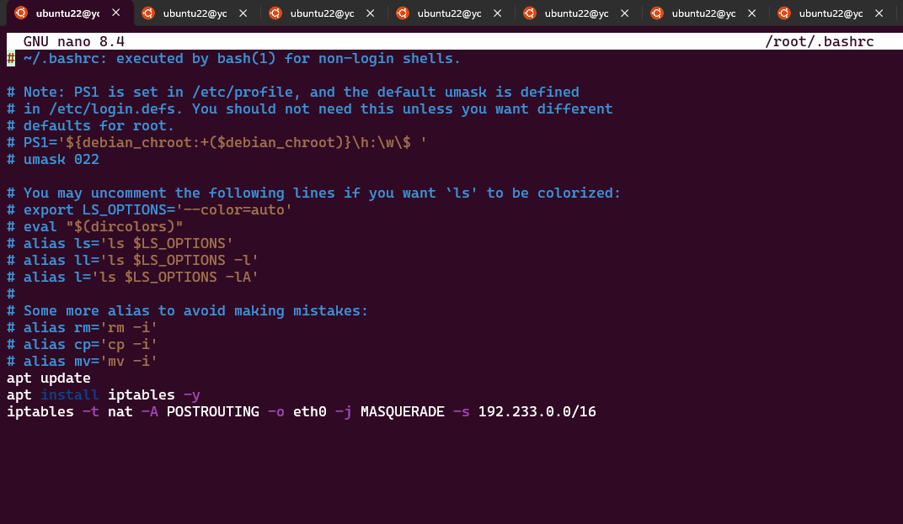
konfigurasi pada router Eonwe /root/.bashrc
```
apt update
apt install iptables -y
iptables -t nat -A POSTROUTING -o eth0 -j MASQUERADE -s 192.233.0.0/16
```

3. Kabar dari Barat menyapa Timur. Pastikan kelima klien dapat saling berkomunikasi lintas jalur (routing internal via Eonwe berfungsi), lalu pastikan setiap host non-router menambahkan resolver 192.168.122.1 saat interfacenya aktif agar akses paket dari internet tersedia sejak awal.

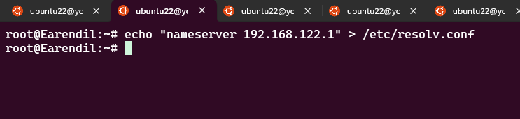
Masukkan resolver 192.168.122.1 ke semua non-router

```
echo "nameserver 192.168.122.1" > /etc/resolv.conf
```
Kemudian mengecek ngeping ip 192.233.2.2 pada terminal router timur misal Earendil
```sh
ping 192.233.1.2
```
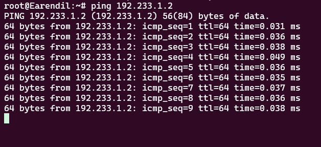
4. Para penjaga nama naik ke menara, di Tirion (ns1/master) bangun zona <xxxx>.com sebagai authoritative dengan SOA yang menunjuk ke ns1.<xxxx>.com dan catatan NS untuk ns1.<xxxx>.com dan ns2.<xxxx>.com. Buat A record untuk ns1.<xxxx>.com dan ns2.<xxxx>.com yang mengarah ke alamat Tirion dan Valmar sesuai glosarium, serta A record apex <xxxx>.com yang mengarah ke alamat Sirion (front door), aktifkan notify dan allow-transfer ke Valmar, set forwarders ke 192.168.122.1. Di Valmar (ns2/slave) tarik zona <xxxx>.com dari Tirion dan pastikan menjawab authoritative. pada seluruh host non-router ubah urutan resolver menjadi IP dari ns1.<xxxx>.com → ns2.<xxxx>.com → 192.168.122.1. Verifikasi query ke apex dan hostname layanan dalam zona dijawab melalui ns1/ns2.


**Tirion**

```sh
apt update
apt install bind9 -y
ln -s /etc/init.d/named /etc/init.d/bind9
```
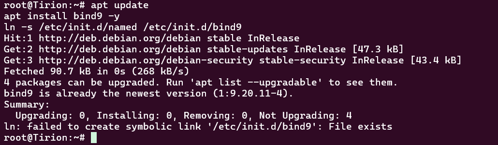

```sh
cat <<EOF > /etc/bind/named.conf.options
options {
  directory "/var/cache/bind";

  forwarders {
    192.168.122.1;
  };

  allow-query { any; };
  auth-nxdomain no;
  listen-on { any; };
  listen-on-v6 { any; };
};

EOF
```
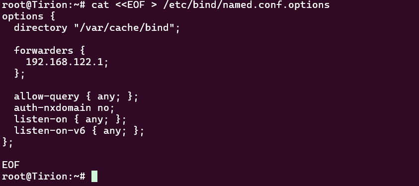

```
mkdir -p /etc/bind/k44 && cat <<EOF > /etc/bind/k44/k44.com
\$TTL    604800          ; Waktu cache default (detik)
@       IN      SOA     ns1.k44.com. root.k44.com. (
                        2025100401 ; Serial (format YYYYMMDDXX)
                        604800     ; Refresh (1 minggu)
                        86400      ; Retry (1 hari)
                        2419200    ; Expire (4 minggu)
                        604800 )   ; Negative Cache TTL

@        IN      NS     ns1.k44.com.
@        IN      NS     ns2.k44.com.

ns1     IN       A      192.233.3.3
ns2     IN       A      192.233.3.4

@       IN       A      192.233.3.2

EOF
```
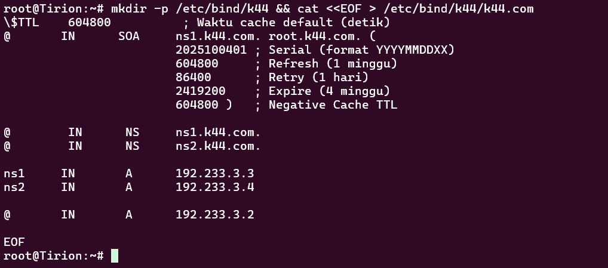

```
cat <<EOF > /etc/bind/named.conf.local
zone "k44.com" {
  type master;
  file "/etc/bind/k44/k44.com";
  allow-transfer { 192.233.3.4; };
  notify yes;
};

EOF
```
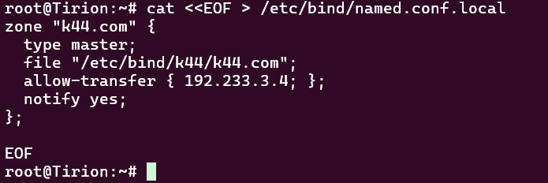

```
service bind9 restart
```
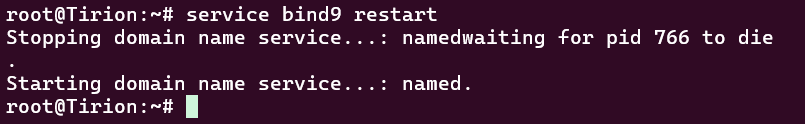

```
echo "nameserver 192.233.3.3" > /etc/resolv.conf
echo "nameserver 192.233.3.4" >> /etc/resolv.conf
echo "nameserver 192.168.122.1" >> /etc/resolv.conf
```
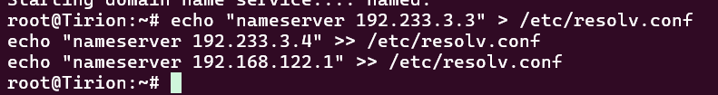
```
dig @localhost k44.com
```
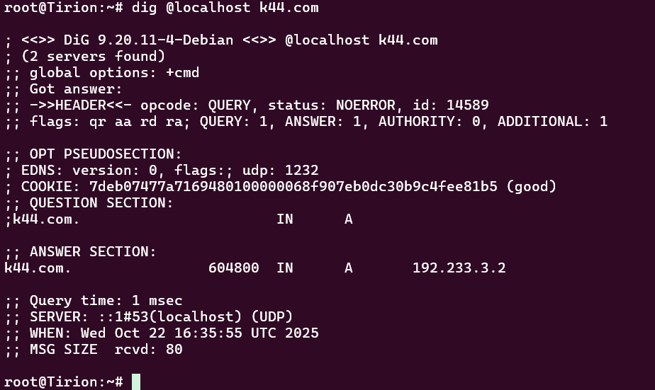

**Valmar**

```
apt update
apt install bind9 -y
ln -s /etc/init.d/named /etc/init.d/bind9
```
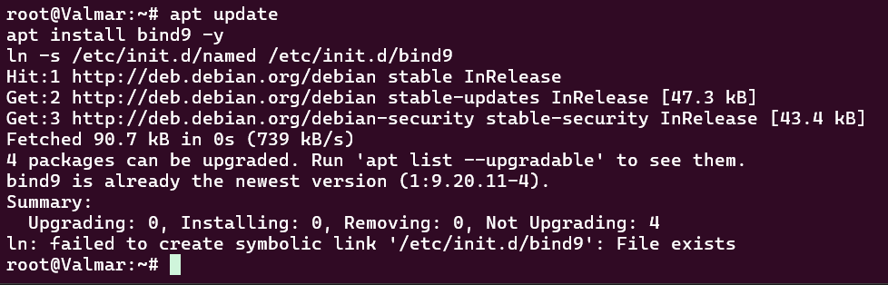
```
cat <<EOF > /etc/bind/named.conf.options
options {
  directory "/var/cache/bind";

  forwarders {
    192.168.122.1;
  };

  allow-query { any; };
  auth-nxdomain no;
  listen-on { any; };
  listen-on-v6 { any; };
};

EOF
```
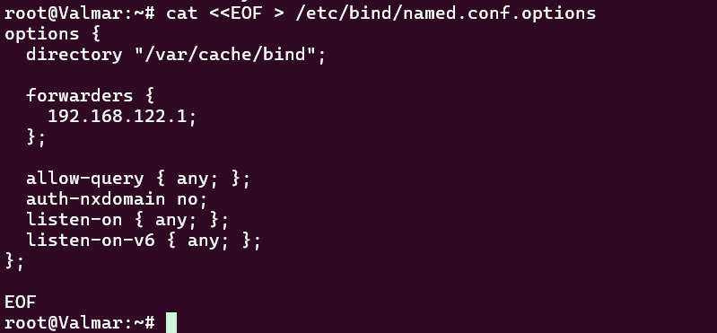
```
mkdir -p /var/lib/bind/k44 && chown bind:bind /var/lib/bind/k44 && cat <<EOF > /etc/bind/named.conf.local
zone "k44.com" {
  type slave;
  masters { 192.233.3.3; };
  file "/var/lib/bind/k44/k44.com";
};

EOF
```
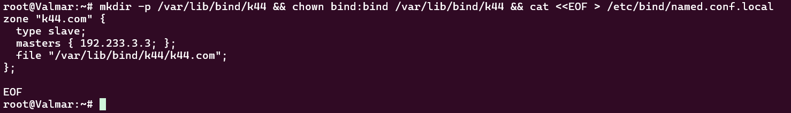

```
service bind9 restart
```
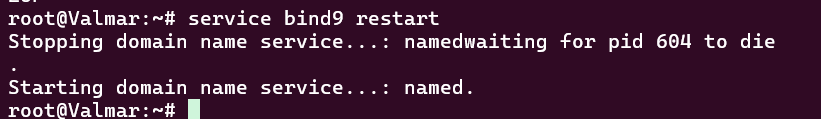


**All node**

```
echo "nameserver 192.233.3.3" > /etc/resolv.conf
echo "nameserver 192.233.3.4" >> /etc/resolv.conf
echo "nameserver 192.168.122.1" >> /etc/resolv.conf
```
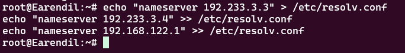

5. “Nama memberi arah,” kata Eonwe. Namai semua tokoh (hostname) sesuai glosarium, eonwe, earendil, elwing, cirdan, elrond, maglor, sirion, tirion, valmar, lindon, vingilot, dan verifikasi bahwa setiap host mengenali dan menggunakan hostname tersebut secara system-wide. Buat setiap domain untuk masing masing node sesuai dengan namanya (contoh: eru.<xxxx>.com) dan assign IP masing-masing juga. Lakukan pengecualian untuk node yang bertanggung jawab atas ns1 dan ns2


```
cat <<EOF >> /etc/bind/k44/k44.com
earendil       IN       A      192.233.1.2
elwing         IN       A      192.233.1.3
cirdan         IN       A      192.233.2.2
elrond         IN       A      192.233.2.3
maglor         IN       A      192.233.2.4
sirion         IN       A      192.233.3.2
lindon         IN       A      192.233.3.5
vingilot       IN       A      192.233.3.6

EOF
```
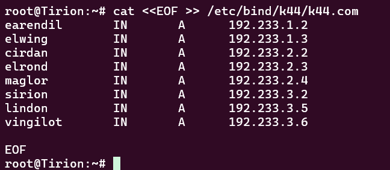

```
service bind9 restart
```
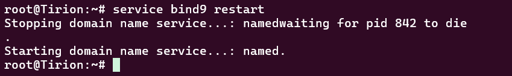

6. Lonceng Valmar berdentang mengikuti irama Tirion. Pastikan zone transfer berjalan, Pastikan Valmar (ns2) telah menerima salinan zona terbaru dari Tirion (ns1). Nilai serial SOA di keduanya harus sama


**Tirion**

```
dig @192.233.3.3 k44.com SOA +short
```
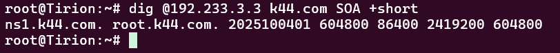

**Valmar**

```
dig @192.233.3.4 k44.com SOA +short
```
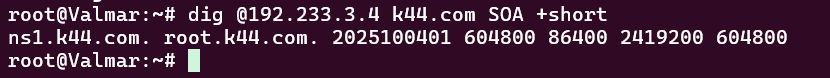

7. Peta kota dan pelabuhan dilukis. Sirion sebagai gerbang, Lindon sebagai web statis, Vingilot sebagai web dinamis. Tambahkan pada zona <xxxx>.com A record untuk sirion.<xxxx>.com (IP Sirion), lindon.<xxxx>.com (IP Lindon), dan vingilot.<xxxx>.com (IP Vingilot). Tetapkan CNAME :
www.<xxxx>.com → sirion.<xxxx>.com, 
static.<xxxx>.com → lindon.<xxxx>.com, dan 
app.<xxxx>.com → vingilot.<xxxx>.com. 
Verifikasi dari dua klien berbeda bahwa seluruh hostname tersebut ter-resolve ke tujuan yang benar dan konsisten.


```
cat <<EOF >> /etc/bind/k44/k44.com
www       IN       CNAME      sirion.k44.com.
static    IN       CNAME      lindon.k44.com.
app       IN       CNAME      elrond.k44.com.

EOF
```
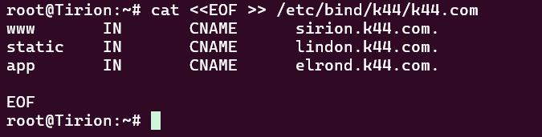

```
service bind9 restart
```
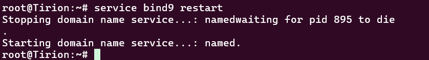

8. Setiap jejak harus bisa diikuti. Di Tirion (ns1) deklarasikan satu reverse zone untuk segmen DMZ tempat Sirion, Lindon, Vingilot berada. Di Valmar (ns2) tarik reverse zone tersebut sebagai slave, isi PTR untuk ketiga hostname itu agar pencarian balik IP address mengembalikan hostname yang benar, lalu pastikan query reverse untuk alamat Sirion, Lindon, Vingilot dijawab authoritative.


#### **Konfigurasi di Tirion (Master)**


```
cat <<EOF >> /etc/bind/named.conf.local
zone "3.233.192.in-addr.arpa" {
    type master;
    file "/etc/bind/k44/3.233.192.in-addr.arpa";
    allow-transfer { 192.233.3.4; };
};
EOF
```
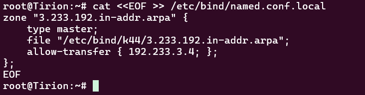

```
cat <<EOF > /etc/bind/k44/3.233.192.in-addr.arpa
\$TTL    604800
@       IN      SOA     ns1.k44.com. root.k44.com. (
                        2025100401 ; Serial
                        604800     ; Refresh
                        86400      ; Retry
                        2419200    ; Expire
                        604800 )   ; Negative Cache TTL

@        IN      NS     ns1.k44.com.
@        IN      NS     ns2.k44.com.

2       IN       PTR    sirion.k44.com.
5       IN       PTR    lindon.k44.com.
6       IN       PTR    vingilot.k44.com.
EOF
```
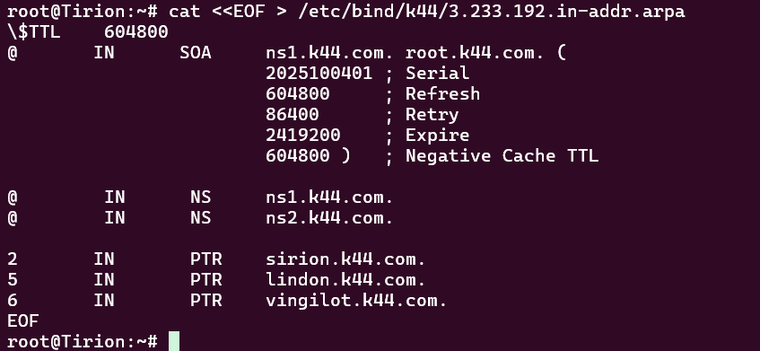

#### **Konfigurasi di Valmar (Slave)**


```
cat <<EOF >> /etc/bind/named.conf.local
zone "3.233.192.in-addr.arpa" {
  type slave;
  masters { 192.233.3.3; };
  file "/var/lib/bind/k44/3.233.192.in-addr.arpa";
};
EOF
```
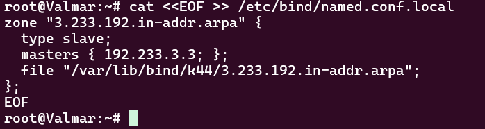
#### **Verifikasi**


```
host -t ptr 192.233.3.2
host -t ptr 192.233.3.5
host -t ptr 192.233.3.6
```

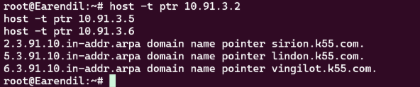
Alamat IP berhasil dipetakan  ke *hostname* yang sesuai.


---
9. Lampion Lindon dinyalakan. Jalankan web statis pada hostname static.<xxxx>.com dan buka folder arsip /annals/ dengan autoindex (directory listing) sehingga isinya dapat ditelusuri. Akses harus dilakukan melalui hostname, bukan IP.
---

#### **Konfigurasi di Lindon**


```
apt update
apt install apache2 -y
```
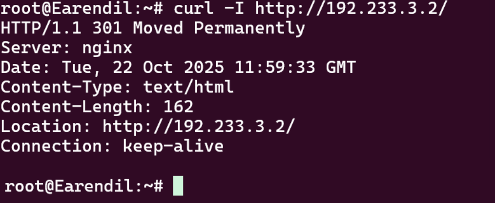

```
mkdir -p /var/www/annals/
```
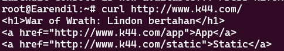


```
cat <<EOF > /etc/apache2/sites-available/000-default.conf
<VirtualHost *:80>
    ServerAdmin webmaster@lindon.k44.com
    DocumentRoot /var/www/annals
    <Directory /var/www/annals>
        Options +Indexes
        AllowOverride None
        Require all granted
    </Directory>

    ErrorLog /var/log/apache2/error.log
    CustomLog /var/log/apache2/access.log combined
</VirtualHost>
EOF
```


Restart layanan Apache2 untuk mengecek semua perubahan.

```
service apache2 restart
```

#### **Validasi**


```
curl static.k44.com
```


---
10. Vingilot mengisahkan cerita dinamis. Jalankan web dinamis (PHP-FPM) pada hostname app.<xxxx>.com dengan beranda dan halaman about, serta terapkan rewrite sehingga /about berfungsi tanpa akhiran .php. Akses harus dilakukan melalui hostname.

---


#### **Konfigurasi di Vingilot**

Install package yang diperlukan

```
apt install apache2 php php8.4-fpm libapache2-mod-fcgid -y
```


Selanjutnya, kami mengkonfigurasi *Virtual Host* Apache untuk meneruskan permintaan file `.php` ke *service* PHP-FPM melalui *socket*.

```
cat <<EOF > /etc/apache2/sites-available/000-default.conf
<VirtualHost *:80>
    ServerAdmin webmaster@vingilot.k44.com
    DocumentRoot /var/www/html
    <Directory /var/www/html>
        AllowOverride All
    </Directory>
    <FilesMatch \.php$>
        SetHandler "proxy:unix:/var/run/php/php8.4-fpm.sock|fcgi://localhost/"
    </FilesMatch>
</VirtualHost>
EOF
```


Untuk mengaktifkan URL *rewrite* (misalnya `/about` menjadi `about.php`), kami membuat file `.htaccess` di direktori web.

```
cat <<EOF > /var/www/html/.htaccess
RewriteEngine On
RewriteRule ^about$ about.php [L]
EOF
```


#### **Validasi**


1.  **Mengakses Halaman Utama:** Perintah ini untuk memverifikasi eksekusi PHP dasar.

    ```
    curl http://app.k44.com/
    ```


2.  **Mengakses Halaman dengan URL Rewrite:** Perintah ini untuk memverifikasi bahwa aturan di `.htaccess` berfungsi.

    ```
    curl http://app.k44.com/about
    ```

---
11. Di muara sungai, Sirion berdiri sebagai reverse proxy. Terapkan path-based routing: /static → Lindon dan /app → Vingilot, sambil meneruskan header Host dan X-Real-IP ke backend. Pastikan Sirion menerima www.<xxxx>.com (kanonik) dan sirion.<xxxx>.com, dan bahwa konten pada /static dan /app di-serve melalui backend yang tepat.
---

#### **Konfigurasi di Sirion**

Install Nginx

```sh
apt update
apt install nginx -y
```
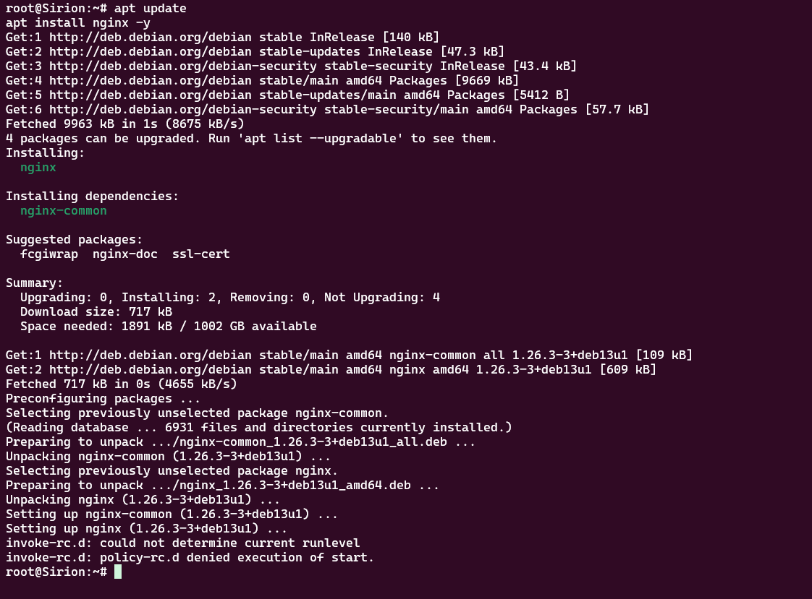

Selanjutnya, kami membuat file konfigurasi *server block* utama untuk Nginx. Konfigurasi ini melakukan beberapa hal penting:

  * `listen 80`: Mendengarkan permintaan masuk pada port 80.
  * `server_name www.k44.com sirion.k44.com`: Merespons permintaan yang ditujukan untuk kedua nama domain ini.
  * `proxy_set_header`: Meneruskan *header* penting seperti `Host` dan IP asli klien (`X-Real-IP`) ke server *backend*. Ini penting agar server *backend* tahu siapa klien yang sebenarnya.
  * `location /static/`: Ini adalah aturan *path-based routing*. Setiap permintaan yang URL-nya diawali dengan `/static/` akan diteruskan (`proxy_pass`) ke server Lindon (`http://lindon.k44.com/`).
  * `location /app/`: Demikian pula, setiap permintaan yang URL-nya diawali dengan `/app/` akan diteruskan ke server Vingilot (`http://vingilot.k44.com/`).


```
cat <<EOF > /etc/nginx/sites-available/default
server {
    listen 80;
    server_name www.k44.com sirion.k44.com;

    proxy_set_header Host \$host;
    proxy_set_header X-Forwarded-For \$proxy_add_x_forwarded_for;
    proxy_set_header X-Real-IP \$remote_addr;

    location / {
        root /var/www/html;
        index index.html index.htm;
        try_files \$uri \$uri/ =404;
    }

    location /static/ {
        proxy_pass http://lindon.k44.com/;
    }

    location /app/ {
        proxy_pass http://vingilot.k44.com/;
    }
}
EOF
```
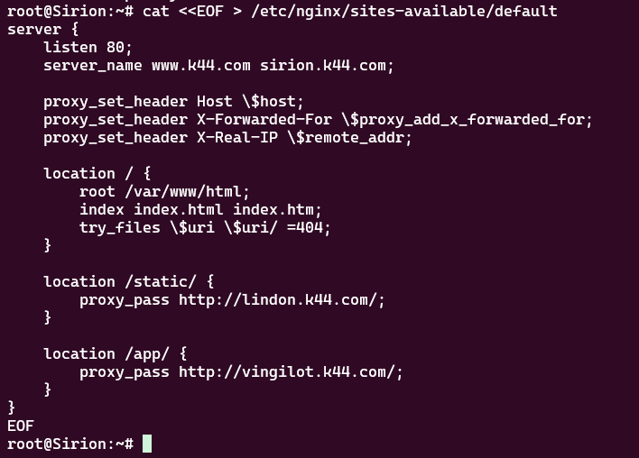

restart nginx

```sh
service nginx restart
```


#### **Validasi**


1.  Mengakses Path Statis (`/static/`):
    Kami mengirim permintaan ke `www.k44.com/static/`. Sirion seharusnya meneruskan ini ke Lindon.

    ```sh
    curl http://www.k44.com/static/
    ```

2.  Mengakses Path Dinamis (`/app/`):
    Kami mengirim permintaan ke `www.k44.com/app/`. Sirion seharusnya meneruskan ini ke Vingilot.

    ```
    curl http://www.k44.com/app/
    ```


  


---
12. Ada kamar kecil di balik gerbang yakni /admin. Lindungi path tersebut di Sirion menggunakan Basic Auth, akses tanpa kredensial harus ditolak dan akses dengan kredensial yang benar harus diizinkan.
---


#### **Konfigurasi di Sirion**

```
apt install apache2-utils -y
```
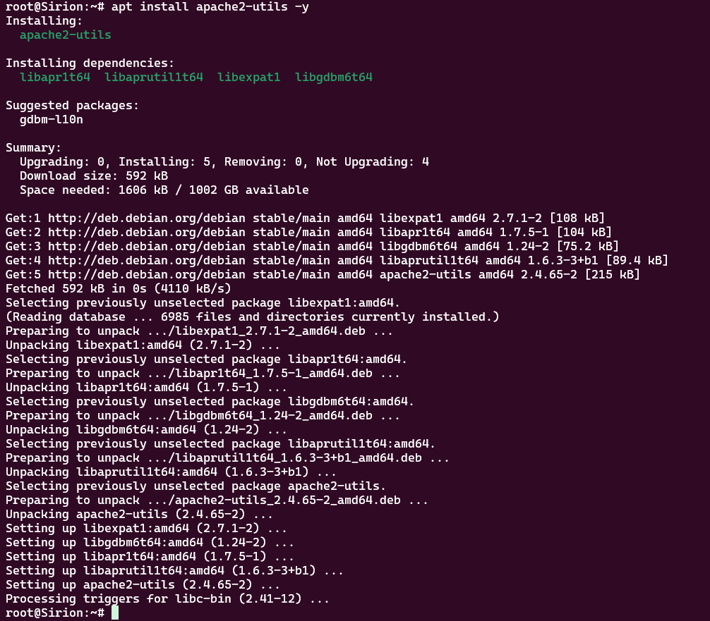

Kemudian menggunakan `htpasswd` untuk membuat file kata sandi di `/etc/nginx/.htpasswd`. Kata sandi `sirion123`.

```
htpasswd -cb /etc/nginx/.htpasswd sirion sirion123
```
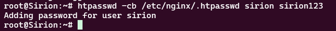
Kemudian, kami memperbarui file konfigurasi Nginx

  * `auth_basic`: Menampilkan pesan "Sirion Restricted Area" pada kotak *login*.
  * `auth_basic_user_file`: Menunjuk ke file `/etc/nginx/.htpasswd` sebagai sumber kredensial yang valid.


```
cat <<EOF > /etc/nginx/sites-available/default
server {
    listen 80;
    server_name www.k44.com sirion.k44.com;

    # ... (konfigurasi proxy_set_header dan location lain) ...

    location ^~ /admin/ {
        auth_basic "Sirion Restricted Area";
        auth_basic_user_file /etc/nginx/.htpasswd;
        alias /var/www/admin/;
        index index.html;
    }
}
EOF
```
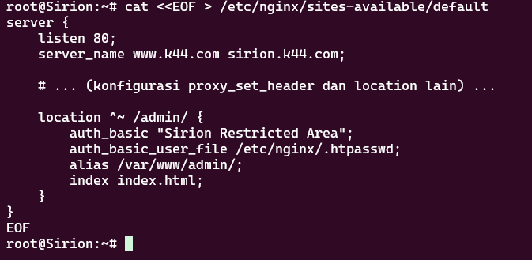

Membuat direktori dan file `index.html` sederhana.

```
mkdir -p /var/www/admin
echo "Sirion Admin GG" > /var/www/admin/index.html
```
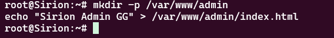

Restart Nginx.

```
service nginx restart
```
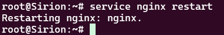
--

#### **Validasi**


1.  **Mengakses Tanpa Kredensial (Harus Gagal):**
    Kami mencoba mengakses *path* `/admin/` tanpa memberikan nama pengguna atau kata sandi.

    ```sh
    curl -I http://www.k44.com/admin/
    ```

2.  **Mengakses Dengan Kredensial yang Benar (Harus Berhasil):**
    Kami mencoba lagi, kali ini dengan menyertakan kredensial yang benar (`sirion:sirion123`) menggunakan opsi `--user`.

    ```
    curl --user sirion:sirion123 http://www.k44.com/admin/
    ```

 


---
13. “Panggil aku dengan nama,” ujar Sirion kepada mereka yang datang hanya menyebut angka. Kanonisasikan endpoint, akses melalui IP address Sirion maupun sirion.<xxxx>.com harus redirect 301 ke www.<xxxx>.com sebagai hostname kanonik.
---


#### **Konfigurasi di Sirion**

Untuk mencapai ini, kami menambahkan *server block* baru di bagian atas file konfigurasi Nginx (`/etc/nginx/sites-available/default`). *Server block* ini secara khusus menangani permintaan yang ditujukan langsung ke alamat IP Sirion.

  * **`server_name 192.233.3.2;`**: Aturan ini hanya berlaku jika *host* yang diminta adalah alamat IP `192.233.3.2`.
  * **`return 301 http://www.k44.com$request_uri;`**: Perintah ini menginstruksikan Nginx untuk mengembalikan respons `301 Moved Permanently`, yang memberitahu *browser* atau klien untuk pindah ke alamat `http://www.k44.com`, dengan tetap mempertahankan *path* URL aslinya (`$request_uri`).

<!-- end list -->

```sh
# Menambahkan server block baru untuk kanonikalisasi
cat <<EOF > /etc/nginx/sites-available/default
server {
    server_name 192.233.3.2;
    return 301 http://www.k44.com\$request_uri;
}

# ... (server block utama untuk www.k44.com berada di bawahnya) ...

EOF

# Menerapkan perubahan
service nginx restart
```

--

#### **Validasi**

Untuk membuktikan bahwa kanonikalisasi berfungsi dengan benar, kami melakukan pengujian dari klien **Earendil** menggunakan `curl` dengan opsi `-I` untuk memeriksa *header* respons dari server.

**Cara Validasi:**
Kami mengirim permintaan langsung ke alamat IP Sirion dan memeriksa apakah server merespons dengan pengalihan (redirect) yang benar.

```sh
curl -I http://192.233.3.2/
```

**Hasil yang Diharapkan:**
Jika konfigurasi berhasil, server tidak akan menampilkan konten halaman. Sebaliknya, ia akan mengirimkan *header* respons yang berisi:

  * **`HTTP/1.1 301 Moved Permanently`**: Kode status yang menandakan pengalihan permanen.
  * **`Location: http://www.k44.com/`**: URL tujuan ke mana klien harus diarahkan.


---
14. Di Vingilot, catatan kedatangan harus jujur. Pastikan access log aplikasi di Vingilot mencatat IP address klien asli saat lalu lintas melewati Sirion (bukan IP Sirion).
---

#### **Konfigurasi di Vingilot**

Untuk mencapai ini, kami mengaktifkan modul `remoteip` pada Apache di Vingilot. Modul ini dirancang khusus untuk mengganti alamat IP koneksi dengan alamat IP yang disediakan dalam *header* permintaan.

```sh
a2enmod remoteip
```

Selanjutnya, kami memperbarui file konfigurasi *Virtual Host* Apache di Vingilot dengan menambahkan dua arahan penting:

  * **`RemoteIPHeader X-Real-IP`**: Memberitahu Apache untuk mencari IP klien asli di dalam *header* bernama `X-Real-IP`. *Header* ini sebelumnya sudah kita atur di Nginx (Sirion) pada soal 11.
  * **`RemoteIPTrustedProxy 192.233.3.2`**: Memberitahu Apache untuk hanya mempercayai nilai `X-Real-IP` jika permintaan datang dari *proxy* yang terpercaya, yaitu Sirion dengan alamat IP `192.233.3.2`.

<!-- end list -->

```sh
cat <<EOF > /etc/apache2/sites-available/000-default.conf
<VirtualHost *:80>
    ServerAdmin webmaster@vingilot.k44.com
    DocumentRoot /var/www/html

    # ... (konfigurasi lainnya) ...

    RemoteIPHeader X-Real-IP
    RemoteIPTrustedProxy 192.233.3.2

    ErrorLog /var/log/apache2/error.log
    CustomLog /var/log/apache2/access.log combined
</VirtualHost>
EOF
```

Terakhir, kami me-restart layanan Apache2 untuk menerapkan perubahan.

```sh
service apache2 restart
```


--

#### **Validasi**

Untuk membuktikan bahwa Vingilot sekarang mencatat IP klien yang benar, kami melakukan serangkaian langkah verifikasi.

**Cara Validasi:**

1.  **Kirim Permintaan dari Klien:** Pertama, dari terminal **Earendil** (dengan IP `192.233.1.2`), kami mengirimkan sebuah permintaan ke layanan dinamis melalui Sirion.

    ```sh
    curl http://www.k44.com/app/
    ```


2.  **Periksa Log di Vingilot:** Segera setelah permintaan dikirim, kami membuka terminal **Vingilot** dan memeriksa baris terakhir dari file `access.log` Apache.

    ```sh
    tail -n 1 /var/log/apache2/access.log
    ```


Dengan munculnya alamat IP `192.233.1.2` di dalam log Vingilot, kami berhasil memvalidasi bahwa server *backend* kini memiliki catatan yang "jujur" mengenai siapa yang mengaksesnya.

---
15. Pelabuhan diuji gelombang kecil, salah satu klien yakni Elrond menjadi penguji dan menggunakan ApacheBench (ab) untuk membombardir http://www.<xxxx>.com/app/ dan http://www.<xxxx>.com/static/ melalui hostname kanonik. Untuk setiap endpoint lakukan 500 request dengan concurrency 10, dan rangkum hasil dalam tabel ringkas.
---

#### **Konfigurasi di Elrond**

Langkah pertama di Elrond adalah menginstal paket `apache2-utils`, yang di dalamnya terdapat alat `ab`.

```sh
apt update
apt install apache2-utils -y
```

Setelah instalasi selesai, kami siap untuk menjalankan pengujian.

--

#### **Validasi dan Pengujian**

Kami menjalankan dua perintah `ab` secara terpisah, satu untuk setiap *endpoint*, melalui nama domain kanonik `www.k44.com`.

**Cara Validasi:**

1.  **Uji Beban pada Layanan Dinamis (`/app/`):**
    Perintah ini mengirimkan 500 permintaan ke Vingilot, dengan 10 koneksi konkuren.

    ```sh
    ab -n 500 -c 10 http://www.k44.com/app/
    ```


2.  **Uji Beban pada Layanan Statis (`/static/`):**
    Perintah ini mengirimkan 500 permintaan ke Lindon, dengan 10 koneksi konkuren.

    ```sh
    ab -n 500 -c 10 http://www.k44.com/static/
    ```

**Hasil yang Diharapkan:**
Setelah setiap perintah selesai, ApacheBench akan mencetak laporan statistik. Metrik utama yang kami perhatikan adalah:

  * **`Failed requests`**: Angka ini harus **0**, yang menandakan server mampu menangani semua permintaan tanpa eror.
  * **`Requests per second`**: Menunjukkan throughput server. Angka yang lebih tinggi berarti kinerja lebih baik.
  * **`Time per request`**: Waktu rata-rata untuk melayani satu permintaan. Angka yang lebih rendah berarti server lebih responsif.

#### **Rangkuman Hasil**

Berikut adalah rangkuman hasil dari pengujian yang kami lakukan. Kedua layanan berhasil menangani semua permintaan tanpa ada yang gagal.

| Metrik | Layanan Dinamis (`/app/`) | Layanan Statis (`/static/`) |
| : | : | : |
| Total Permintaan | 500 | 500 |
| Permintaan Gagal | 0 | 0 |
| **Requests per second** | **3870.42** [\#/detik] | **4023.63** [\#/detik] |
| **Time per request** | **2.584** [ms] | **2.485** [ms] |

Hasil pengujian ini memvalidasi bahwa kedua layanan mampu menangani beban yang diberikan tanpa mengalami kegagalan. Sesuai perkiraan, layanan statis menunjukkan kinerja yang sedikit lebih unggul (throughput lebih tinggi dan waktu respons lebih rendah) dibandingkan dengan layanan dinamis.


---
16. Badai mengubah garis pantai. Ubah A record lindon.<xxxx>.com ke alamat baru (ubah IP paling belakangnya saja agar mudah), naikkan SOA serial di Tirion (ns1) dan pastikan Valmar (ns2) tersinkron, karena static.<xxxx>.com adalah CNAME → lindon.<xxxx>.com, seluruh akses ke static.<xxxx>.com mengikuti alamat baru, tetapkan TTL = 30 detik untuk record yang relevan dan verifikasi tiga momen yakni sebelum perubahan (mengembalikan alamat lama), sesaat setelah perubahan namun sebelum TTL kedaluwarsa (masih alamat lama karena cache), dan setelah TTL kedaluwarsa (beralih ke alamat baru).
---


#### **Konfigurasi di Tirion (Master)**

Semua perubahan konfigurasi DNS dilakukan pada server *master*, yaitu **Tirion**.

Langkah pertama adalah mengedit file *zone* `/etc/bind/k44/k44.com`. Kami melakukan dua perubahan penting:

1.  **Mengubah Record A:** Alamat IP untuk `lindon` diubah dari `192.233.3.5` menjadi `192.233.3.7`, dan kami menetapkan TTL spesifik `30` detik.
2.  **Menaikkan Nomor Serial SOA:** Nomor serial kami naikkan menjadi `2025100402`. Ini adalah langkah krusial untuk memberitahu server *slave* (Valmar) bahwa ada pembaruan pada *zone*.

<!-- end list -->

```sh
# Menimpa file zone dengan konfigurasi baru
cat <<'EOF' > /etc/bind/k44/k44.com
$TTL    604800
@       IN      SOA     ns1.k44.com. root.k44.com. (
                        2025100402 ; Serial (Sudah dinaikkan)
                        # ... baris SOA lainnya
                        )

# ... (record NS dan A lainnya) ...

lindon      30 IN       A      192.233.3.7   ; <-- PERUBAHAN DI SINI

# ... (record CNAME) ...
EOF
```

Setelah file disimpan, kami me-restart layanan `bind9` untuk menerapkan perubahan tersebut.

```sh
service bind9 restart
```

--

#### **Validasi**

Untuk membuktikan bahwa perubahan IP dan TTL berfungsi, kami melakukan verifikasi dari klien **Earendil**.

**Cara Validasi:**
Kami menjalankan perintah `dig static.k44.com` pada terminal Earendil setelah perubahan di Tirion diterapkan.

**Hasil Pengamatan:**
Saat pengujian, Earendil langsung menerima **IP baru (`192.233.3.7`)** pada permintaan pertamanya. Hal ini mengindikasikan bahwa tidak ada *cache* aktif untuk alamat IP yang lama pada *resolver* Earendil saat permintaan dibuat.

Meskipun kami tidak mengamati momen transisi dari IP lama ke IP baru, hasil ini tetap memvalidasi beberapa poin penting:

1.  Perubahan *record* A di server DNS Tirion telah berhasil dan aktif.
2.  Klien (Earendil) berhasil melakukan *query* dan menerima data yang sudah diperbarui dari server DNS.
3.  TTL `30` detik yang baru telah diterima oleh klien, yang akan digunakan untuk *caching* pada permintaan-permintaan berikutnya.


---
17. Andaikata bumi bergetar dan semua tertidur sejenak, mereka harus bangkit sendiri. Pastikan layanan inti bind9 di ns1/ns2, nginx di Sirion/Lindon, dan PHP-FPM di Vingilot autostart saat reboot, lalu verifikasi layanan kembali menjawab sesuai fungsinya.
---

--

#### **Konfigurasi**

Kami menjalankan perintah yang sesuai pada setiap server untuk mengaktifkan layanan utamanya.

  * **Di Tirion (ns1) & Valmar (ns2):**
    Mengaktifkan layanan DNS BIND9.

    ```sh
    update-rc.d bind9 defaults
    ```

  * **Di Sirion (Reverse Proxy):**
    Mengaktifkan layanan Nginx.

    ```sh
    update-rc.d nginx defaults
    ```

  * **Di Lindon (Web Statis):**
    Mengaktifkan layanan web Apache2.

    ```sh
    update-rc.d apache2 defaults
    ```

  * **Di Vingilot (Web Dinamis):**
    Mengaktifkan layanan Apache2 dan PHP-FPM.

    ```sh
    update-rc.d apache2 defaults
    update-rc.d php8.4-fpm defaults
    ```

--

#### **Validasi dan Troubleshooting**

Untuk membuktikan bahwa konfigurasi *auto-start* berhasil, kami melakukan metode verifikasi dengan me-reboot salah satu server dan memeriksa status layanannya setelah kembali menyala.

**Cara Validasi:**

1.  **Simulasi Reboot:** Kami melakukan simulasi *reboot* pada server **Tirion** dengan cara **Stop** dan **Start** *node* dari antarmuka GNS3.

2.  **Pengecekan Status Awal (Gagal):** Setelah server kembali *online*, pengecekan status awal menunjukkan bahwa layanan `bind9` gagal berjalan secara otomatis.

    ```sh
    root@Tirion:~# service bind9 status
    bind is not running ... failed!
    ```

3.  **Investigasi Masalah:** Kami melakukan investigasi untuk mencari penyebab kegagalan.

      * `named-checkconf` tidak menunjukkan adanya kesalahan sintaks.
      * Kami menjalankan BIND9 di *foreground* menggunakan `named -g -d 3` untuk melihat pesan *startup* secara langsung. Dari *log* tersebut, kami menemukan error **`permission denied`** saat BIND9 mencoba mengakses file `/etc/bind/rndc.key` dan file jurnal di `/var/cache/bind`.

4.  **Perbaikan Izin Akses:** Kami memperbaiki masalah ini dengan mengatur kepemilikan file dan direktori yang benar menggunakan `chown` dan `chgrp` agar dapat diakses oleh pengguna `bind`.

    ```sh
    chown -R bind:bind /var/cache/bind
    chgrp bind /etc/bind/rndc.key
    chmod 640 /etc/bind/rndc.key
    ```

5.  **Validasi Ulang (Berhasil):** Setelah memperbaiki izin akses, kami mencoba me-restart layanan secara manual dan berhasil.

    ```sh
    root@Tirion:~# service bind9 restart
    Starting domain name service...: named.
    root@Tirion:~# service bind9 status
    bind is running.
    ```

    Keberhasilan ini membuktikan bahwa masalahnya memang terletak pada izin akses. Dengan perbaikan ini, kami dapat memastikan layanan BIND9 kini akan dapat dimulai secara otomatis pada proses *booting* berikutnya. Proses validasi yang sama dapat diaplikasikan untuk semua layanan lain yang telah dikonfigurasi.


---
18. Sang musuh memiliki banyak nama. Tambahkan melkor.<xxxx>.com sebagai record TXT berisi “Morgoth (Melkor)” dan tambahkan morgoth.<xxxx>.com sebagai CNAME → melkor.<xxxx>.com, verifikasi query TXT terhadap melkor dan bahwa query ke morgoth mengikuti aliasnya.
---

--

#### **Konfigurasi di Tirion (Master)**

Semua perubahan konfigurasi DNS dilakukan pada server *master*, yaitu **Tirion**. Kami menambahkan dua baris berikut ke bagian akhir dari file *zone* `/etc/bind/k44/k44.com`.

  * **`melkor IN TXT "Morgoth (Melkor)"`**: Baris ini membuat sebuah `TXT` record untuk `melkor.k44.com` yang berisi string teks "Morgoth (Melkor)".
  * **`morgoth IN CNAME melkor.k44.com.`**: Baris ini membuat `morgoth.k44.com` sebagai alias (CNAME) yang menunjuk ke `melkor.k44.com`.

<!-- end list -->

```sh
cat <<EOF >> /etc/bind/k44/k44.com
; TXT dan CNAME record
melkor       IN       TXT      "Morgoth (Melkor)"
morgoth      IN       CNAME    melkor.k44.com.
EOF
```

Setelah file disimpan, kami menaikkan nomor serial SOA dan me-restart layanan `bind9` untuk menerapkan perubahan tersebut.

```sh
service bind9 restart
```

--

#### **Validasi**

Untuk membuktikan bahwa kedua *record* tersebut berfungsi sesuai harapan, kami melakukan verifikasi dari klien **Earendil** menggunakan perintah `dig` dengan menargetkan tipe *record* `TXT`.

**Cara Validasi:**

1.  **Query Langsung ke `melkor.k44.com`:**
    Kami melakukan `dig` langsung ke nama domain yang memiliki `TXT` record.

    ```sh
    dig melkor.k44.com TXT
    ```

    **Hasil yang Diharapkan:** *Output* pada `ANSWER SECTION` harus menunjukkan `TXT` record dengan isi "Morgoth (Melkor)".


2.  **Query ke Alias `morgoth.k44.com`:**
    Kami melakukan `dig` ke nama aliasnya. Karena `morgoth` adalah CNAME dari `melkor`, *resolver* akan mengikuti alias tersebut dan mengembalikan *record* dari tujuannya.

    ```sh
    dig morgoth.k44.com TXT
    ```

    **Hasil yang Diharapkan:** *Output* pada `ANSWER SECTION` akan menampilkan dua hal: pertama, bahwa `morgoth.k44.com` adalah `CNAME` untuk `melkor.k44.com`, dan kedua, `TXT` record dari `melkor.k44.com` itu sendiri.


---
19. Pelabuhan diperluas bagi para pelaut. Tambahkan havens.<xxxx>.com sebagai CNAME → www.<xxxx>.com, lalu akses layanan melalui hostname tersebut dari dua klien berbeda untuk memastikan resolusi dan rute aplikasi berfungsi.
---

--

#### **Konfigurasi di Tirion (Master)**

Konfigurasi ini hanya memerlukan satu baris tambahan di file *zone* `/etc/bind/k44/k44.com` pada server **Tirion**. Baris ini membuat `havens.k44.com` sebagai CNAME yang menunjuk ke `www.k44.com`.

```sh
cat <<EOF >> /etc/bind/k44/k44.com
havens      IN       CNAME    www.k44.com.
EOF
```

Setelah file disimpan, kami menaikkan nomor serial SOA dan me-restart layanan `bind9` untuk menerapkan perubahan.

```sh
service bind9 restart
```

--

#### **Validasi**

Untuk membuktikan bahwa alias baru ini berfungsi dan semua permintaan dirutekan dengan benar melalui *reverse proxy*, kami melakukan verifikasi dari dua klien yang berbeda, yaitu **Earendil** dan **Cirdan**.

**Cara Validasi:**
Kami menggunakan `curl` dari kedua klien untuk mengakses salah satu layanan (misalnya `/app/`) menggunakan *hostname* `havens.k44.com` yang baru.

  * **Dari Earendil:**

    ```sh
    curl http://havens.k44.com/app/
    ```

  * **Dari Cirdan:**

    ```sh
    curl http://havens.k44.com/app/
    ```

**Hasil yang Diharapkan:**
Jika konfigurasi berhasil, kedua perintah `curl` tersebut harus mengembalikan output `Hello Vingilot`.

Hasil ini memvalidasi beberapa hal secara berurutan:

1.  DNS berhasil menerjemahkan `havens.k44.com` ke `www.k44.com`.
2.  DNS kemudian menerjemahkan `www.k44.com` ke `sirion.k44.com` dan akhirnya ke alamat IP Sirion.
3.  Permintaan berhasil masuk ke Sirion (reverse proxy), yang kemudian meneruskannya ke Vingilot.
4.  Vingilot memproses permintaan dan mengembalikan konten yang benar.

---
20. Kisah ditutup di beranda Sirion. Sediakan halaman depan bertajuk “War of Wrath: Lindon bertahan” yang memuat tautan ke /app dan /static. Pastikan seluruh klien membuka beranda dan menelusuri kedua tautan tersebut menggunakan hostname (mis. www.<xxxx>.com), bukan IP address.
---


Sebagai tugas terakhir, kami membuat halaman depan (*landing page*) sederhana untuk disajikan oleh **Sirion**. Halaman ini berfungsi sebagai portal utama yang memberikan navigasi mudah ke dua layanan utama yang ada di belakang *reverse proxy*: layanan statis (`/static`) dan layanan dinamis (`/app`).

--

#### **Konfigurasi di Sirion**

Kami membuat sebuah file `index.html` sederhana di dalam direktori *root* Nginx pada server **Sirion** (`/var/www/html/`). Halaman ini berisi judul "War of Wrath: Lindon bertahan" dan dua tautan (*hyperlink*) yang mengarah ke *path* `/app` dan `/static`.

```
cat <<EOF > /var/www/html/index.html
<h1>War of Wrath: Lindon bertahan</h1>
<a href="http://www.k44.com/app">App</a>
<a href="http://www.k44.com/static">Static</a>
EOF
```
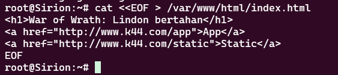

Karena Nginx di Sirion sudah dikonfigurasi pada soal sebelumnya untuk menyajikan file dari direktori `/var/www/html/` untuk *path root* (`/`), tidak ada perubahan konfigurasi Nginx tambahan yang diperlukan untuk soal ini.

--

#### **Validasi**


**Mengakses Halaman Depan:**
    Pertama, kami mengakses nama domain kanonik `www.k44.com` tanpa *path* tambahan.

    ```sh
    curl http://www.k44.com/
    ```

    **Hasil yang Diharapkan:** *Output*-nya harus berupa kode HTML dari file `index.html` yang telah kami buat, yang berisi judul dan kedua tautan.


Keberhasilan `curl` dalam mengambil konten halaman depan memvalidasi bahwa *reverse proxy* Sirion berhasil menyajikan konten lokalnya sendiri dan siap untuk mengarahkan pengguna ke layanan *backend* yang sesuai melalui tautan yang disediakan.
